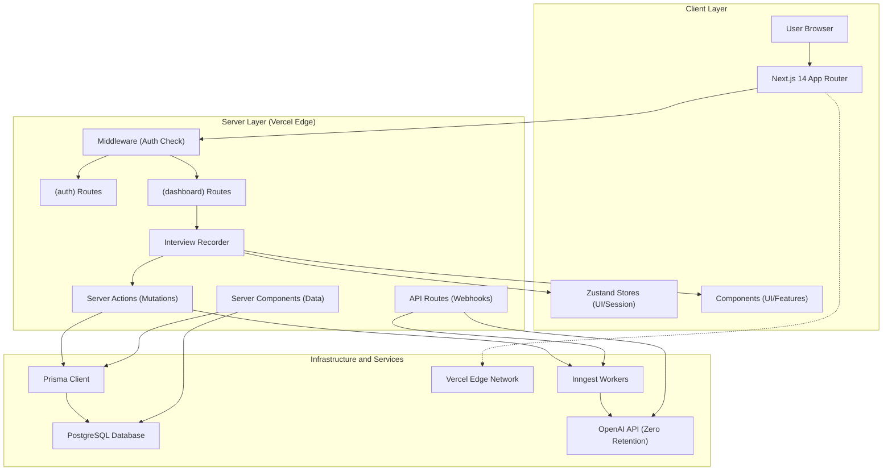

# BlockChainInterview - Master Blueprint

**Designer:** Albert Vincent Lei

**Target Platform:** Generic AI Agent

**Version:** 1.0.0

**Date:** 2026-05-17

---

## Executive Purpose
Create a way to verify interviews between individuals using dual phones with biometric verification and Monad blockchain for transcript authentication to combat AI deepfakes

---

## 🧭 How to Use This Blueprint

> [!IMPORTANT]
> **The Backend-First Approach:** Because this application requires a robust data foundation, this blueprint is designed 'Backend-First'. This is different from a typical 'UI-First' vibe coding approach where you start with a visual mockup.
> 
> **What to expect:** For the first half of this blueprint, you are building the 'engine'—database schemas, APIs, and background pipelines. **You will not see a visual user interface during these steps.** Once the engine is secure, the later steps will guide you to build the frontend UI that connects to it.

### 💡 Copy-Paste Workflow
Every step in this document contains **Copy & Paste blocks** for your IDE's AI (like Cursor, Windsurf, or OpenClaw).
1. Copy the **Phase 1: Planning** block and paste it into your AI chat.
2. Wait for the AI to generate an `implementation_plan.md` and review it.
3. Once approved, copy the **Phase 2: Execution** block to instruct the AI to write the actual code.

---

## Table of Contents

- [ ] [Step 0: Initialize Project Rules](#step-0-initialize-project-rules)
- [ ] [Step 1: Setup AI Agent Guardrails & Context Files](#step-1-setup-ai-agent-guardrails-&-context-files)
- [ ] [Step 2: Initialize Monorepo & Project Structure](#step-2-initialize-monorepo-&-project-structure)
- [ ] [Step 3: Define Complete Directory Structure](#step-3-define-complete-directory-structure)
- [ ] [Step 4: Configure Environment Variables & Secrets](#step-4-configure-environment-variables-&-secrets)
- [ ] [Step 5: Design Database Schema & Relationships](#step-5-design-database-schema-&-relationships)
- [ ] [Step 6: Document API Contract Specifications](#step-6-document-api-contract-specifications)
- [ ] [Step 7: Create Shared Type Definitions Package](#step-7-create-shared-type-definitions-package)
- [ ] [Step 8: Build Adapter Interface Contracts](#step-8-build-adapter-interface-contracts)
- [ ] [Step 9: Implement Biometric Authentication Adapter](#step-9-implement-biometric-authentication-adapter)
- [ ] [Step 10: Setup Local SQLite Storage Adapter](#step-10-setup-local-sqlite-storage-adapter)
- [ ] [Step 11: Configure Speech-to-Text Adapter](#step-11-configure-speech-to-text-adapter)
- [ ] [Step 12: Implement Blockchain Adapter for Monad](#step-12-implement-blockchain-adapter-for-monad)
- [ ] [Step 13: Build Session State Machine Logic](#step-13-build-session-state-machine-logic)
- [ ] [Step 14: Create User Authentication Flow](#step-14-create-user-authentication-flow)
- [ ] [Step 15: Design Interview Session Screen](#step-15-design-interview-session-screen)
- [ ] [Step 16: Build Dual Phone Connection Handshake](#step-16-build-dual-phone-connection-handshake)
- [ ] [Step 17: Implement Audio Recording Component](#step-17-implement-audio-recording-component)
- [ ] [Step 18: Create Transcript Display Interface](#step-18-create-transcript-display-interface)
- [ ] [Step 19: Generate AI Transcription Service](#step-19-generate-ai-transcription-service)
- [ ] [Step 20: Evaluate Transcription Quality & Accuracy](#step-20-evaluate-transcription-quality-&-accuracy)
- [ ] [Step 21: Implement Blockchain Hash Submission](#step-21-implement-blockchain-hash-submission)
- [ ] [Step 22: Deploy Smart Contract for Verification](#step-22-deploy-smart-contract-for-verification)
- [ ] [Step 23: Build Session Verification Flow](#step-23-build-session-verification-flow)
- [ ] [Step 24: Pre-Flight Impact Analysis & Risk Assessment](#step-24-pre-flight-impact-analysis-&-risk-assessment)
- [ ] [Step 25: Security Audit & Penetration Testing](#step-25-security-audit-&-penetration-testing)
- [ ] [Step 26: Documentation & Developer Handoff](#step-26-documentation-&-developer-handoff)

---

# Executive Summary

### The Layman's Vision
# Layman's App Overview (Loop 0)

## App Name
**BlockChainInterview**

## Core Purpose
We are building a mobile application that creates an unbreakable chain of trust for recorded conversations. In an era where AI can fake voices and video, this app ensures that an interview actually happened, exactly as recorded, with the specific people who claim to have spoken.

Instead of just saving a file, we are creating a "Digital Certificate of Truth." We use two phones to record simultaneously and link the conversation to a public blockchain ledger. This means the record cannot be edited, deleted, or faked after the fact. It is designed to solve the problem of "deepfakes" by making the original source verifiable and permanent.

## Target Audience
While the app is available to the **General Public**, it is specifically designed for users who need high-assurance proof that a conversation occurred.
*   **Journalists:** To prove the authenticity of source interviews and combat misinformation.
*   **Legal Professionals:** To create deposition and witness testimony records that are resistant to tampering.
*   **Corporate HR & Compliance:** To document sensitive meetings where accountability is critical.
*   **Academic Researchers:** To preserve the integrity of qualitative data and interview transcripts.

## Exact Features We Are Building
To deliver this level of security, we are building the following specific capabilities:

*   **Dual-Phone Synchronization:** Both the interviewer and the interviewee use their own phones to record the same session simultaneously. This prevents a single person from altering the audio, as we have two independent records that must match.
*   **Biometric Multi-Signature Authentication:** Before the interview starts, both users verify their identity using their phone's biometrics (Face ID or Fingerprint). This links the recording directly to their unique digital identity, ensuring they cannot deny they were present.
*   **Blockchain Transcript Authentication:** As the conversation is transcribed, the text is hashed and written to the **Monad Blockchain**. This creates a permanent, timestamped receipt that proves when the words were spoken.
*   **Smart Contract Verification:** We use automated "Smart Contracts" to check that both parties signed in correctly. If the conditions aren't met (e.g., one person doesn't sign), the record is flagged as incomplete.
*   **Cryptographic Immutability:** Once the interview is finished and signed, the transcript is locked. Even if someone tries to edit the text later, the digital "fingerprint" will change, alerting everyone that the document has been tampered with.
*   **Non-Repudiation Guarantee:** The combination of biometrics, dual-recording, and blockchain ensures "Non-repudiation." This means a user cannot legally deny that they participated in the conversation or that the transcript is accurate, because the cryptographic evidence proves otherwise.

## Why We Are Building It This Way
We are choosing this complex architecture because standard recording apps are vulnerable to editing and do not verify the identity of the speakers. By requiring two phones and a blockchain ledger, we are trading some convenience for **absolute verification**. This ensures that for high-stakes situations, the record is not just a file, but a verified piece of evidence that stands up to scrutiny.

---

### The System Workflow
# System Workflow Mapping (Loop 1)

## 1. Data & Variables
To support the security model and state management, the system requires the following core data structures. These are designed to be agnostic of specific database technologies (SQL/NoSQL) but strict on schema integrity.

### 1.1 User Entity
*   **`user_id`**: UUID (Primary Key).
*   **`wallet_address`**: Public key associated with the user's identity on the Monad Blockchain.
*   **`biometric_public_key`**: Public key derived from the device's secure enclave (used to verify local biometric signatures).
*   **`email`**: Encrypted string (for notification and account recovery).
*   **`kyc_status`**: Enum (`None`, `Verified`, `Rejected`).
*   **`preferences`**: JSON object (e.g., `auto_transcribe`, `notification_settings`).

### 1.2 Session Entity
*   **`session_id`**: UUID (Primary Key).
*   **`status`**: Enum (`Pending`, `Active`, `Processing`, `Completed`, `Flagged`).
*   **`initiator_id`**: UUID (Reference to User Entity).
*   **`participant_id`**: UUID (Reference to User Entity).
*   **`start_timestamp`**: ISO 8601 (UTC).
*   **`end_timestamp`**: ISO 8601 (UTC) or Null.
*   **`encryption_key`**: AES-256 Key (Encrypted with both users' public keys for retrieval).
*   **`audio_hash_a`**: SHA-256 Hash of Audio File A.
*   **`audio_hash_b`**: SHA-256 Hash of Audio File B.
*   **`transcript_hash`**: SHA-256 Hash of the final text transcript.
*   **`blockchain_tx_id`**: String (Transaction Hash on Monad).
*   **`smart_contract_address`**: String (Address of the verification contract).

### 1.3 State Management
*   **`SessionState`**: Finite State Machine (FSM).
    *   `INIT`: Session created, waiting for participant.
    *   `AUTH`: Both parties verifying biometrics.
    *   `SYNC`: Audio streams aligning timestamps.
    *   `RECORDING`: Active capture.
    *   `FINALIZE`: Audio processing and hashing.
    *   `VERIFIED`: Blockchain confirmation received.
    *   `INVALID`: Mismatch detected or timeout.

## 2. Feature Mechanics
This section details the logical flow of data for the core approved features.

### 2.1 Dual-Phone Synchronization
1.  **Session Creation:** User A generates a `session_id` and signs it with their private key.
2.  **Invitation:** User A shares `session_id` with User B (via QR or Deep Link).
3.  **Connection Handshake:** Both clients connect to the Orchestrator via WebSocket using the `session_id`.
4.  **Time Sync:** Both clients exchange NTP timestamps to align recording start times within a 500ms tolerance window.
5.  **Data Flow:** Audio chunks are streamed locally to the device (not the server) to ensure raw data integrity. The server only receives metadata and completion hashes.

### 2.2 Biometric Multi-Signature Authentication
1.  **Challenge Generation:** The Orchestrator sends a random nonce (challenge) to both devices.
2.  **Local Verification:** Device A and Device B prompt the user for Face ID/Fingerprint.
3.  **Local Signing:** If biometric passes, the Secure Enclave signs the nonce locally using a derived private key.
4.  **Verification:** The signed nonce is sent to the Orchestrator. The Orchestrator verifies the signature against the stored `biometric_public_key`.
5.  **State Update:** Only if **both** signatures are valid does the Session State transition to `RECORDING`.

### 2.3 Blockchain Transcript Authentication
1.  **Transcription:** Audio is converted to text (via secure STT engine).
2.  **Hashing:** The text transcript is hashed locally (`SHA-256`).
3.  **Transaction Construction:** A payload is created containing: `session_id`, `transcript_hash`, `user_a_sig`, `user_b_sig`, `timestamp`.
4.  **Submission:** The payload is submitted to the Monad Blockchain Smart Contract.
5.  **Receipt:** The Blockchain returns a `transaction_id`. This ID is immutable proof that the specific hash existed at that time.

### 2.4 Smart Contract Verification
1.  **Contract Logic:** The Smart Contract contains a function `verifySession(session_id, hash, sig_a, sig_b)`.
2.  **Condition Check:** The contract checks if `sig_a` matches `User_A_Address` and `sig_b` matches `User_B_Address`.
3.  **Event Emission:** If valid, the contract emits a `VerifiedSession` event.
4.  **Flagging:** If signatures are missing or mismatched, the transaction reverts, and the local app flags the session as `INVALID`.

### 2.5 Cryptographic Immutability & Non-Repudiation
1.  **Locking:** Once the `transaction_id` is received, the local transcript file is "locked" (read-only permissions enforced).
2.  **Verification:** Any future attempt to view the transcript involves re-hashing the file.
3.  **Comparison:** The local hash is compared against the hash stored on the Blockchain.
4.  **Alert:** If hashes differ, the UI displays a "Tampered" warning. The blockchain record serves as the court-admissible truth.

## 3. External Dependencies
The system relies on the following external services and APIs.

| Dependency | Purpose | Criticality |
| :--- | :--- | :--- |
| **Monad Blockchain** | Immutable ledger for storing hashes and transaction IDs. | **Critical** |
| **RPC Node Provider** | Interface to submit transactions to Monad (e.g., Alchemy, Infura equivalent for Monad). | **Critical** |
| **Speech-to-Text (STT)** | Converts audio to text for hashing. Must be high-accuracy. | High |
| **Secure Storage (S3/IPFS)** | Encrypted storage for raw audio files (metadata only goes on-chain). | High |
| **NTP Service** | Time synchronization for logging accuracy. | Medium |
| **Biometric APIs** | iOS LocalAuthentication / Android BiometricPrompt. | **Critical** |

## 4. Workflow Diagram
The following Mermaid.js flowchart maps the complete logical workflow from initiation to immutable verification.

```mermaid
flowchart TD
    %% Nodes
    UserA[User A Device]
    UserB[User B Device]
    Orch[Orchestrator Backend]
    STT[Speech-to-Text Service]
    Chain[Monad Blockchain]
    Store[Secure Encrypted Storage]

    %% Styling
    classDef device fill:#e1f5fe,stroke:#01579b,stroke-width:2px;
    classDef backend fill:#fff3e0,stroke:#e65100,stroke-width:2px;
    classDef external fill:#f3e5f5,stroke:#4a148c,stroke-width:2px;
    classDef chain fill:#e8f5e9,stroke:#1b5e20,stroke-width:2px;

    class UserA,UserB device;
    class Orch,Store backend;
    class STT external;
    class Chain chain;

    %% Process Flow
    UserA -->|1. Create Session| Orch
    Orch -->|2. Generate Session ID| UserA
    UserA -->|3. Share Invite| UserB
    
    UserB -->|4. Accept Invite| Orch
    Orch -->|5. Verify Session Valid| UserB

    subgraph Authentication
        Orch -->|6. Send Nonce| UserA
        UserA -->|7. Biometric Auth| UserA
        UserA -->|8. Sign Nonce| Orch
        Orch -->|9. Send Nonce| UserB
        UserB -->|10. Biometric Auth| UserB
        UserB -->|11. Sign Nonce| Orch
        Orch -->|12. Verify Signatures| Orch
    end

    Orch -->|13. Start Recording| UserA
    Orch -->|13. Start Recording| UserB
    
    UserA -->|14. Stream Audio| UserA
    UserB -->|14. Stream Audio| UserB
    
    UserA -->|15. Save Raw Audio| Store
    UserB -->|15. Save Raw Audio| Store
    
    Orch -->|16. Trigger Transcription| STT
    STT -->|17. Return Transcript| Orch
    
    Orch -->|18. Hash Transcript| Orch
    Orch -->|19. Sign Hash| UserA
    Orch -->|20. Sign Hash| UserB
    
    Orch -->|21. Submit Tx| Chain
    Chain -->|22. Return TxID| Orch
    
    Orch -->|23. Store TxID & Lock| Store
    Orch -->|24. Notify Completion| UserA
    Orch -->|24. Notify Completion| UserB

    subgraph Verification
    UserA -->|25. Request Audit| Orch
    Orch -->|26. Fetch TxID| Chain
    Chain -->|27. Return Hash| Orch
    Orch -->|28. Compare Hash| UserA
    end
```



---

### The Tech Stack
# The Skeleton (Loop 2): Technical Architecture & Stack Selection

## 1. Architecture Confirmation
Based on your feedback, **Option A (Expo + Next.js)** is now **LOCKED**. This stack provides the necessary balance of native mobile security (Secure Enclave access) and AI-friendly development velocity (React/TypeScript).

**Key Decisions:**
*   **Client:** Expo (React Native) for native biometric access (`expo-local-authentication`).
*   **Server:** Next.js (App Router) for the Orchestrator API.
*   **Database:** `expo-sqlite` (Local-First) + Supabase (Cloud Sync).
*   **STT:** **LM Studio** (Local) via Adapter.
*   **Blockchain:** Monad SDK (Adapter Pattern).
*   **State:** Zustand (Client) + TanStack Query (Server Sync).

---

## 2. Preliminary Directory Structure
This structure enforces the **Adapter Pattern** and separates concerns to prevent AI hallucination of business logic.

```text
monad-secure-audit/
├── apps/
│   ├── client/                 # Expo (React Native)
│   │   ├── src/
│   │   │   ├── adapters/       # [CRITICAL] Local/Cloud Implementations
│   │   │   │   ├── biometric/  # expo-local-authentication | Mock
│   │   │   │   ├── storage/    # expo-sqlite | Supabase Client
│   │   │   │   ├── stt/        # LM Studio API | OpenAI Whisper
│   │   │   │   └── blockchain/ # Monad SDK | Hardhat Local
│   │   │   ├── core/           # Business Logic (FSM, Crypto, State)
│   │   │   ├── hooks/          # React Native Hooks
│   │   │   ├── screens/        # UI Components
│   │   │   └── utils/          # Shared Helpers
│   │   └── package.json
│   └── server/                 # Next.js (Orchestrator)
│       ├── src/
│       │   ├── adapters/       # [CRITICAL] Server-side Implementations
│       │   │   ├── db/         # Supabase | Local Postgres
│       │   │   ├── stt/        # Gateway for LM Studio
│       │   │   └── chain/      # RPC Provider | Local Fork
│       │   ├── routes/         # API Endpoints (Next.js API Routes)
│       │   └── lib/            # Utils (Crypto, Hashing, Validation)
│       └── package.json
├── packages/
│   ├── shared/                 # Shared Types & Interfaces
│   │   ├── types/              # User, Session, State Definitions
│   │   └── adapters/           # **Interface Definitions** (The Contract)
│   └── config/                 # ESLint, TSConfig
├── .env                        # Environment Variables (Swap Local/Prod)
├── .env.local                  # Local Overrides (LM Studio URL, etc.)
└── PROJECT_RULES.md            # [DELIVERABLE] AI Agent Instructions
```

---

## 3. PROJECT_RULES.md
*Copy the content below into the root of your project repository. This file instructs the AI Agent on how to generate code.*

```markdown
# PROJECT RULES: Monad Secure Audit

## 1. Role & Objective
You are the **Principal Architect** and **Lead Developer**. Your goal is to build a secure, local-first mobile audit application using React Native (Expo) and Next.js. The system must prioritize cryptographic integrity, biometric security, and local-first prototyping.

## 2. Tech Stack (LOCKED)
- **Client:** Expo (React Native) + TypeScript.
- **Server:** Next.js (App Router) + TypeScript.
- **Database:** `expo-sqlite` (Local) + Supabase (Cloud Sync).
- **State:** Zustand (Client) + TanStack Query (Server).
- **Auth:** `expo-local-authentication` (Native Biometrics).
- **STT:** LM Studio (Local) via Adapter.
- **Blockchain:** Monad SDK (via Adapter).

## 3. Core Architectural Mandates

### 3.1 Adapter Pattern (CRITICAL)
- **Rule:** NO core business logic may directly import SDKs (e.g., `import { openai } from 'openai'`).
- **Rule:** All external dependencies MUST live in `/src/adapters/`.
- **Rule:** Core logic calls interfaces defined in `packages/shared/adapters`.
- **Goal:** Swapping `LMStudioAdapter` for `OpenAIAdapter` must require only an `.env` change, not code changes.

### 3.2 Local-First Prototyping
- **Rule:** Default to local implementations for all services during development.
- **Rule:** Database operations must use `expo-sqlite` first.
- **Rule:** STT must route to `http://localhost:1234` (LM Studio) by default.
- **Rule:** Blockchain interactions must use a Hardhat Local Fork or Testnet by default.

### 3.3 Security & Biometrics
- **Rule:** Biometric verification MUST use `expo-local-authentication`.
- **Rule:** Private keys MUST NEVER leave the device Secure Enclave.
- **Rule:** Signatures are generated locally; only public keys and hashes are shared with the Orchestrator.

### 3.4 Workflow Compliance (Loop 1)
- **Rule:** State transitions must follow the `SessionState` FSM defined in Loop 1 (`INIT` -> `AUTH` -> `SYNC` -> `RECORDING` -> `FINALIZE` -> `VERIFIED`).
- **Rule:** Audio data is streamed locally. The server receives metadata and hashes only.

## 4. File Structure Guidelines
- **`/apps/client/src/adapters/`**: Implementations for Biometrics, Storage, STT, Blockchain.
- **`/apps/client/src/core/`**: Business logic, State Machine, Crypto utilities.
- **`/apps/server/src/adapters/`**: Server-side DB, STT Gateway, Chain RPC.
- **`/packages/shared/`**: TypeScript Interfaces (The Contract).

## 5. Coding Standards
- **Language:** TypeScript (Strict Mode).
- **Naming:** PascalCase for Components, camelCase for functions/variables.
- **Testing:** Unit tests for Adapters before implementation.
- **Documentation:** JSDoc on all public interface methods.

## 6. Environment Variables
- `STT_PROVIDER`: 'lm_studio' | 'openai'
- `CHAIN_PROVIDER`: 'local_fork' | 'monad_testnet'
- `DB_PROVIDER`: 'sqlite' | 'supabase'
- `BIOMETRIC_MODE`: 'native' | 'mock' (Use 'mock' for initial UI dev)

## 7. Immediate Next Steps
1. Initialize Monorepo (Turborepo).
2. Define Shared Interfaces (`packages/shared`).
3. Implement `BiometricAdapter` (Mock first, then Native).
4. Implement `STTAdapter` (LM Studio).
5. Implement `SessionState` FSM in `core/`.
```

---

## 4. Implementation Strategy for AI Agent
When generating code, the AI Agent must adhere to the following sequence to ensure stability:

1.  **Define Interfaces First:** Create the TypeScript interfaces in `packages/shared/adapters` before writing implementation logic.
2.  **Mock Everything:** Implement Mock Adapters for `Biometric`, `STT`, and `Blockchain` to allow UI development without external dependencies.
3.  **Swap Adapters:** Once UI is stable, replace Mock Adapters with Native/Local implementations (`expo-local-authentication`, `LM Studio`).
4.  **Integrate FSM:** Ensure the `SessionState` transitions are guarded by the Adapter results (e.g., cannot move to `RECORDING` until Biometric Adapter returns `SUCCESS`).

## 5. Local Tooling Configuration
To ensure LM Studio works with the Adapter:
1.  **Start LM Studio:** Ensure Local Server is running on port `1234`.
2.  **Select Model:** Load a lightweight Whisper model (e.g., `Systran/faster-whisper-small`).
3.  **Configure Adapter:** Set `STT_PROVIDER=lm_studio` in `.env`.
4.  **Endpoint:** The Adapter should POST to `http://localhost:1234/v1/completions` (or compatible API).

**Proceed to Loop 3: Code Generation.**

---

<a id='step-0-initialize-project-rules'></a>
## <label style='cursor:pointer; display:inline-flex; align-items:center; gap:12px;'><input type='checkbox' class='blueprint-checkbox vibe-checkbox' data-idx='-1'> Step 0: Initialize Project Rules</label>

### Architecture Overview


### ⚠️ Don't Panic! This file is huge.
The code block below contains the master architectural rules for your entire project. **You do not need to read or understand it.**

**Instructions:**
1. Create a file named `PROJECT_RULES.md` in the root folder of your project.
2. Copy the *entire* text block below and paste it into that file.
3. Your AI coding assistant will automatically read this file to ensure it doesn't break your architecture in future steps.

````text
STACK A DEFINITION
--------------------------------------------------------------------------------
Framework: Next.js 14 (App Router)
UI: React 18 (tsx files)
Styling: Tailwind CSS 3.4
State: Zustand 4.5
Language: TypeScript 5.4
Database: PostgreSQL + Prisma 5.10
AI Provider: OpenAI API (Structured Outputs, Zero Retention)
Testing: Vitest + Playwright
Infra: Vercel + Inngest
--------------------------------------------------------------------------------

1. TECH STACK VERSION LOCK
All dependencies must be pinned to exact versions in package.json.
- Frontend: Next.js 14.2.0, React 18.2.0, TypeScript 5.4.0, TanStack Query 5.30.0
- Styling: Tailwind CSS 3.4.0, PostCSS 8.4.0
- State: Zustand 4.5.0
- Backend: Node.js 20.10.0, Prisma 5.10.0 (Edge Runtime Compatible)
- AI: OpenAI SDK 4.30.0 (Transcription & Analysis)
- Testing: Vitest 1.4.0, Playwright 1.42.0
- Deployment: Vercel Edge Network
- Workers: Inngest 3.0.0
- Audio: Server-side Whisper API (Primary). Client-side Web Speech API (Capture Only, No Local AI Processing)

2. PROJECT DIRECTORY STRUCTURE
src/
├── app/                  # Next.js App Router (Routes, Layouts, Pages)
│   ├── (auth)/           # Auth routes group
│   ├── (dashboard)/      # Protected routes group
│   ├── api/              # API Routes (Webhooks, Proxies, Inngest)
│   │   └── inngest/      # Inngest Function Handlers
│   └── layout.tsx        # Root layout
├── components/           # Shared UI Components
│   ├── ui/               # Atoms (Buttons, Inputs)
│   ├── features/         # Molecules (Forms, Cards)
│   └── interview/        # Interview-specific UI (Recorder, Transcript)
├── lib/                  # Utilities
│   ├── audio/            # Audio Processing Logic (Transcription, Hash)
│   ├── db/               # Prisma Client, Migrations
│   ├── utils/            # Generic helpers (CN, Formatters)
│   └── validation/       # Zod Schemas
├── prisma/               # Database Schema
│   └── schema.prisma     # Prisma Schema Definition
├── stores/               # Zustand State Stores
│   ├── interview-store.ts
│   └── ui-store.ts
├── hooks/                # Custom React Hooks
├── types/                # Global TypeScript Definitions
└── tests/                # Test Suites
    ├── unit/
    └── e2e/

3. COMPONENT MODULARITY
All React components (.tsx) must adhere to a strict size limit.
- Maximum lines per file: 150 lines.
- If a component exceeds 150 lines, it MUST be refactored into smaller sub-components.
- Logic separation: UI logic (JSX) must be separated from business logic (Hooks/Utils).
- Props: All components must accept strictly typed props via TypeScript interfaces.
- Reusability: Components must be generic where possible (e.g., <Button /> vs <SubmitButton />).

4. DATA FETCHING
- Primary Pattern: Next.js Server Components (RSC) for data fetching.
- Secondary Pattern: Server Actions for mutations and client-side interactions.
- Client Caching: TanStack Query used for client-side caching, retries, and stale-while-revalidate patterns.
- Caching: 5-minute staleTime for list data; 0 for real-time audio stream data.
- Mutation: All mutations must utilize Server Actions with Optimistic UI updates where safe.
- Error Handling: Fetch errors must be caught and mapped to UI error states (see Section 7).
- Streaming: Use Server Sent Events (SSE) for transcription streaming from Server Actions.
- PII Governance: All PII sent to OpenAI must be masked or minimized. Zero Retention policy enforced via OpenAI API parameters.

5. STATE MANAGEMENT
- Authentication (Cookies/Middleware):
  - User Session MUST be managed via HTTP-only Secure Cookies and Next.js Middleware.
  - Do NOT store authentication tokens or user session data in client-side Zustand stores.
  - Server Components must verify session validity before rendering protected content.
- Global State (Zustand):
  - Use Zustand stores for UI and Interview Session state ONLY (e.g., Recording status, Transcript view).
  - Stores must be atomic (split into small stores: auth-store, interview-store).
  - No direct store modification in components; use actions defined in the store.
- Local State (React):
  - Use useState for form inputs, UI toggles, and ephemeral data.
  - Do not lift state unnecessarily.
- Consumption Declaration:
  - Every UI component consuming Zustand must explicitly declare the specific selector used.
  - Example: const userName = useAuthStore((state) => state.user.name).
  - Components MUST NOT subscribe to the entire store object to prevent unnecessary re-renders.

6. UI/STYLING CONSTRAINTS
- Styling Method: Tailwind CSS utility classes ONLY.
- No: Custom CSS files, styled-components, inline style objects.
- Colors: Use Tailwind semantic colors

7. ERROR HANDLING
- Global Error Boundaries: Wrap route groups in `error.tsx` to catch client-side rendering errors.
- Server Actions: Return standardized error objects (e.g., `{ success: boolean, error?: string }`) to the client.
- API Routes: Return consistent JSON error structures (e.g., `{ message: string, code: string }`).
- UI Feedback: Display user-friendly error messages using Toast notifications or Alert components.
- Logging: Log server-side errors to Vercel Logs or Sentry; do not expose stack traces to the client.
- Recovery: Implement retry logic for transient network failures using TanStack Query (where applicable).
````

---

<a id='step-05-global-database-schema'></a>
## <label style='cursor:pointer; display:inline-flex; align-items:center; gap:12px;'><input type='checkbox' class='blueprint-checkbox vibe-checkbox' data-idx='-1'> Step 0.5: Global Database Schema</label>

**Why:** Before building isolated UI features, the AI needs a unified data model to ensure all API payloads and database migrations align perfectly across the entire application.

**Expectation:** Your IDE will read this schema as context and use it to accurately structure your database models (e.g. Prisma, Drizzle, or Supabase).

#### Table: users

| Column Name | Data Type / Format | Key / Constraint | Description & UI Mapping |
| :--- | :--- | :--- | :--- |
| id | UUID | Primary Key, Unique | Unique user identifier. **Read:** Middleware (Auth Check), `src/stores/auth-store` (User Profile). **Write:** `src/app/api/auth/register` (Server Action). |
| email | VARCHAR(255) | Unique, Not Null | User email address. Used for login and notifications. **Read:** `(auth)/login`, `(dashboard)/settings`. **Write:** `src/lib/validation` (Zod Schema). |
| password_hash | VARCHAR(255) | Not Null, Encrypted | Bcrypt/Argon2 hashed password. **Read:** Never exposed to Client UI. **Write:** `src/app/(auth)/register` (Server Action). |
| role | VARCHAR(50) | Default 'user' | User role (admin, user). **Read:** Middleware (RBAC). **Write:** `src/app/admin` (Admin Panel). |
| created_at | TIMESTAMPTZ | Default NOW() | Account creation timestamp. **Read:** `(dashboard)/profile`. **Write:** `src/lib/db` (Prisma Client). |
| updated_at | TIMESTAMPTZ | Default NOW() | Last profile update timestamp. **Read:** `(dashboard)/profile`. **Write:** `src/lib/db` (Prisma Client). |

#### Table: interview_sessions

| Column Name | Data Type / Format | Key / Constraint | Description & UI Mapping |
| :--- | :--- | :--- | :--- |
| id | UUID | Primary Key, Unique | Unique session identifier for the interview event. **Read:** `(dashboard)/interviews/[id]`. **Write:** `src/app/api/interviews/create` (Server Action). |
| user_id | UUID | Foreign Key -> users.id, Not Null | Link to the user conducting the interview. **Read:** Middleware (Ownership Validation). **Write:** `src/stores/interview-store` (Session Init). |
| title | VARCHAR(255) | Not Null | Human-readable session title. **Read:** `(dashboard)/interviews/list`. **Write:** `(dashboard)/interviews/create`. |
| status | VARCHAR(50) | Enum (draft, active, completed, archived) | Current state of the interview. **Read:** `components/interview/StatusIndicator.tsx`. **Write:** `src/stores/interview-store` (Zustand Actions). |
| duration_ms | INTEGER | Default 0 | Total duration of the session in milliseconds. **Read:** `(dashboard)/interviews/[id]/stats`. **Write:** `src/lib/audio` (Calculation Logic). |
| is_public | BOOLEAN | Default False | Shareability flag. **Read:** `(public)/share/[id]`. **Write:** `(dashboard)/settings`. |
| created_at | TIMESTAMPTZ | Default NOW() | Session start time. **Read:** `(dashboard)/interviews/list`. **Write:** `src/lib/db` (Prisma Client). |

#### Table: interview_transcripts

| Column Name | Data Type / Format | Key / Constraint | Description & UI Mapping |
| :--- | :--- | :--- | :--- |
| id | UUID | Primary Key, Unique | Unique transcript segment identifier. **Read:** `components/interview/TranscriptView.tsx`. **Write:** `src/app/api/transcribe/stream` (SSE Handler). |
| session_id | UUID | Foreign Key -> interview_sessions.id, Not Null | Link to the parent interview session. **Read:** `src/app/(dashboard)/interviews/[id]`. **Write:** Server Action (Transcription Logic). |
| role | VARCHAR(50) | Enum (user, interviewer, system) | Speaker identification. **Read:** `components/interview/TranscriptLine.tsx`. **Write:** AI Prompt (Role Assignment). |
| content | TEXT | Not Null | Transcribed text content. **Read:** `components/interview/TranscriptView.tsx`. **Write:** OpenAI API (Whisper/Transcription). |
| start_time | FLOAT | Not Null | Start time offset in seconds. **Read:** `components/interview/AudioPlayer.tsx`. **Write:** Whisper API Response. |
| end_time | FLOAT | Not Null | End time offset in seconds. **Read:** `components/interview/AudioPlayer.tsx`. **Write:** Whisper API Response. |
| is_pii_masked | BOOLEAN | Default True | Flag indicating PII masking status. **Read:** Audit Logs. **Write:** `src/lib/audio` (PII Governance Logic). |

#### Table: ai_feedback

| Column Name | Data Type / Format | Key / Constraint | Description & UI Mapping |
| :--- | :--- | :--- | :--- |
| id | UUID | Primary Key, Unique | Unique analysis record identifier. **Read:** `(dashboard)/interviews/[id]/analysis`. **Write:** `src/lib/ai` (OpenAI Analysis). |
| session_id | UUID | Foreign Key -> interview_sessions.id, Not Null | Link to the analyzed session. **Read:** `(dashboard)/interviews/[id]/analysis`. **Write:** `src/app/api/analyze` (Inngest Worker). |
| summary | TEXT | Not Null | High-level feedback summary. **Read:** `components/features/FeedbackCard.tsx`. **Write:** OpenAI API (Structured Output). |
| scores | JSONB | Not Null | Structured scoring data (e.g., {communication: 8, tech: 9}). **Read:** `components/features/ScoreChart.tsx`. **Write:** OpenAI API (Structured Output). |
| created_at | TIMESTAMPTZ | Default NOW() | Analysis generation timestamp. **Read:** `(dashboard)/interviews/[id]/analysis`. **Write:** `src/lib/db` (Prisma Client). |

#### Table: audio_files

| Column Name | Data Type / Format | Key / Constraint | Description & UI Mapping |
| :--- | :--- | :--- | :--- |
| id | UUID | Primary Key, Unique | Unique audio asset identifier. **Read:** `components/interview/AudioPlayer.tsx`. **Write:** `src/app/api/upload` (Server Action). |
| session_id | UUID | Foreign Key -> interview_sessions.id, Not Null | Link to the parent interview session. **Read:** `(dashboard)/interviews/[id]`. **Write:** `src/stores/interview-store` (Recording State). |
| storage_url | VARCHAR(500) | Not Null | Secure URL to audio blob (e.g., Vercel Blob/S3). **Read:** `components/interview/AudioPlayer.tsx`. **Write:** `src/lib/db` (Prisma Client). |
| duration_sec | INTEGER | Not Null | Audio duration in seconds. **Read:** `(dashboard)/interviews/[id]/stats`. **Write:** Client-side Audio API (Recorder). |
| is_processed | BOOLEAN | Default False | Flag for transcription completion. **Read:** `components/interview/StatusIndicator.tsx`. **Write:** Inngest Event Handler. |
| created_at | TIMESTAMPTZ | Default NOW() | Upload timestamp. **Read:** `(dashboard)/interviews/[id]`. **Write:** `src/lib/db` (Prisma Client). |

---

## Multi-Agent Parallel Execution Strategy

To minimize merge conflicts and maximize throughput, steps are grouped into **Phases**. Within each Phase, **Agents** are assigned to isolated file paths (e.g., `/src/backend`, `/src/frontend`, `/docs`). Agents in the same Phase execute simultaneously only if their target directories do not overlap.

### Phase 1: Foundation & Infrastructure (Sequential)
*Critical path: Establishes the workspace and safety constraints.*

| Order | Agent | Task | Target Scope |
| :--- | :--- | :--- | :--- |
| 1 | **Agent 1** | Setup AI Agent Guardrails & Context Files | `/config/agents` |
| 2 | **Agent 1** | Initialize Monorepo & Project Structure | Root |
| 3 | **Agent 1** | Define Complete Directory Structure | Root |
| 4 | **Agent 1** | Configure Environment Variables & Secrets | `/env`, `.github` |

### Phase 2: Contracts & Schema (Parallel)
*Critical path: Defines data structures and interfaces before implementation.*

| Agent | Task | Target Scope | Isolation Check |
| :--- | :--- | :--- | :--- |
| **Agent A** | Design Database Schema & Relationships | `/db/schemas` | No overlap with Types |
| **Agent B** | Document API Contract Specifications | `/docs/api` | No overlap with DB |
| **Agent B** | Build Adapter Interface Contracts | `/src/adapters/interfaces` | Read-only for Agents A/B |
| **Agent A** | Create Shared Type Definitions Package | `/packages/types` | Read-only for Agents A/B |

### Phase 3: Core Services & Adapters (Parallel)
*Critical path: Backend logic and external integrations. Agents work on isolated service folders.*

| Agent | Task | Target Scope | Isolation Check |
| :--- | :--- | :--- | :--- |
| **Agent A** | Implement Biometric Authentication Adapter | `/services/auth` | Distinct from Blockchain/AI |
| **Agent A** | Setup Local SQLite Storage Adapter | `/services/storage` | Distinct from Blockchain/AI |
| **Agent A** | Create User Authentication Flow | `/services/auth` | Same folder as Auth Adapter |
| **Agent B** | Implement Blockchain Adapter for Monad | `/services/blockchain` | Distinct from Auth/AI |
| **Agent B** | Deploy Smart Contract for Verification | `/contracts` | Distinct from Auth/AI |
| **Agent B** | Implement Blockchain Hash Submission | `/services/blockchain` | Same folder as Adapter |
| **Agent B** | Build Session Verification Flow | `/services/verification` | Tied to Blockchain logic |
| **Agent C** | Configure Speech-to-Text Adapter | `/services/ai` | Distinct from Auth/Blockchain |
| **Agent C** | Generate AI Transcription Service | `/services/ai` | Same folder as Adapter |
| **Agent C** | Evaluate Transcription Quality & Accuracy | `/services/ai` | Same folder as Service |
| **Agent C** | Build Session State Machine Logic | `/services/state` | Core logic, isolated from UI |

### Phase 4: Frontend & Integration (Parallel)
*Critical path: UI components and client-side networking. Agents work on `/components` vs `/hooks`.*

| Agent | Task | Target Scope | Isolation Check |
| :--- | :--- | :--- | :--- |
| **Agent A** | Design Interview Session Screen | `/frontend/components` | UI Layout only |
| **Agent A** | Create Transcript Display Interface | `/frontend/components` | UI Layout only |
| **Agent A** | Implement Audio Recording Component | `/frontend/components` | UI Logic only |
| **Agent B** | Build Dual Phone Connection Handshake | `/frontend/hooks` | Networking/Logic |
| **Agent B** | Integrate Session Verification Flow (UI) | `/frontend/hooks` | Consumes Service |

### Phase 5: Assurance & Delivery (Sequential)
*Critical path: Final validation and handoff. Requires full codebase access.*

| Order | Agent | Task | Target Scope |
| :--- | :--- | :--- | :--- |
| 1 | **Agent 1** | Pre-Flight Impact Analysis & Risk Assessment | Global |
| 2 | **Agent 1** | Security Audit & Penetration Testing | Global |
| 3 | **Agent 1** | Documentation & Developer Handoff | `/docs` |

### Execution Rules
1.  **Lock Files:** Agents must lock specific files (e.g., `package.json`, `tsconfig.json`) before writing to prevent conflicts.
2.  **Interface Contracts:** Agents in Phase 3 must strictly adhere to the interfaces defined in Phase 2.
3.  **Merge Gates:** Code cannot be merged to `main` until Phase 5 is complete.

---

<a id='step-1-setup-ai-agent-guardrails-&-context-files'></a>
## <label style='cursor:pointer; display:inline-flex; align-items:center; gap:12px;'><input type='checkbox' class='blueprint-checkbox vibe-checkbox' data-idx='0'> Step 1: Setup AI Agent Guardrails & Context Files</label>

<div class="manual-action-alert">
<h4>⚠️ Manual Developer Action Required</h4>
<ul>
    <li>Obtain API keys for your selected AI Provider (e.g., OpenAI, Anthropic) and store them in your `.env` file as `AI_PROVIDER_API_KEY`.</li>
    <li>Ensure your database connection string is configured in `.env` as `DATABASE_URL` before initializing the schema.</li>
</ul>
</div>

**Purpose (Why we are building this):**
This feature establishes strict rules and context limits for the AI Agent to prevent hallucinations and ensure biometric data integrity during interview verification. It is necessary to maintain trust in the transcript authentication process and prevent AI-generated deepfakes from corrupting the blockchain record.

**User Experience (UX) Flow:**
*   **Admin Configuration Panel:** Administrators define system prompts and safety thresholds here before an interview session begins.
*   **Interview Setup Page:** The active guardrail configuration is loaded silently when a user initiates a verified interview session.

### Phase 1: Planning (Copy & Paste to your AI first)
```text
We are building the **Setup AI Agent Guardrails & Context Files** feature.

#### 1. UX & Logic Description
This feature connects to the **Admin Configuration Panel** (`/admin/config`) where users input system instructions, and the **Interview Setup Page** (`/interview/setup`) where these rules are applied to the session context.
The UI will display input fields for "System Prompt" and "Safety Thresholds" with a "Save Configuration" button that triggers a serverless API call.

#### 2. Technical Guardrails & Constraints
* **Data Validation:** System Prompt must be 10-5000 characters, Safety Threshold must be an enum value (STRICT, MODERATE, LOOSE).
* **API/Database:** POST to `/api/agent/config` to save to `ai_configurations` table (columns: `id`, `system_prompt`, `safety_level`, `updated_at`).
* **Testing Requirements:** Test that invalid safety levels return 400 Bad Request, and that long prompts are truncated or rejected to prevent token overflow.
* **Structured Outputs:** Define a Zod schema for the configuration payload to ensure strict typing before sending to the AI provider.
* **Separation of AI:** Ensure the configuration endpoint does not use the AI to validate its own config; use standard schema validation instead.

#### 3. Action Requested
Please review the relevant files and generate an `implementation_plan.md` for this feature. Do not write code until the plan is approved.
```

### Phase 2: Execution & Verification (Copy & Paste after approving the plan)
```text
I have approved the implementation plan. 

Please execute the plan and write the code. 
Before finalizing your work:
1. Check the code for common errors (recursive loops, disconnects between JSON schemas and natural prompts, formatting errors).
2. Ensure you have respected the global `PROJECT_RULES.md`.
3. Run 10 mock dry runs internally to ensure the code is safe and functional.
```

---

<a id='step-2-initialize-monorepo-&-project-structure'></a>
## <label style='cursor:pointer; display:inline-flex; align-items:center; gap:12px;'><input type='checkbox' class='blueprint-checkbox vibe-checkbox' data-idx='1'> Step 2: Initialize Monorepo & Project Structure</label>

<div class="manual-action-alert">
<h4>⚠️ Manual Developer Action Required</h4>
<ul>
    <li>Initialize the git repository using `git init` in the root directory.</li>
    <li>Install the monorepo package manager (e.g., `pnpm init`) to manage dependencies.</li>
</ul>
</div>

**Purpose (Why we are building this):**
This step establishes the modular codebase foundation required for blockchain integration and biometric security. It prevents technical debt by enforcing a consistent structure before feature development begins.

**User Experience (UX) Flow:**
This infrastructure step connects to the `/admin/config` page for system settings and `/interview/setup` for user flows. No direct user interface is rendered during this specific initialization phase.

**Expected Outcome:**
If successful, the directory structure will be ready for feature implementation without path errors. If it fails, build scripts will crash due to missing dependencies or incorrect folder hierarchies.

### Phase 1: Planning (Copy & Paste to your AI first)
```text
We are building the **Initialize Monorepo & Project Structure** feature.

#### 1. UX & Logic Description
Establish a root directory with `apps` and `packages` folders to separate client and shared logic. Connect this structure to the `/admin/config` and `/interview/setup` routes for future feature injection.

#### 2. Technical Guardrails & Constraints
* **Data Validation:** Define Zod schemas for all API payloads, specifically `POST /api/agent/config` requiring `system_prompt` (string, max 2000 chars) and `safety_level` (enum).
* **API/Database:** Use `ai_configurations` table (columns: `id`, `system_prompt`, `safety_level`, `updated_at`) for persistence. Use standard serverless API routes for simple tasks.
* **Testing Requirements:** Test directory creation, dependency installation, and route registration. Verify edge cases like missing `package.json` files or permission errors.
* **Global State:** Read `PROJECT_RULES.md` Tech Matrix strictly; forbid packages not listed there.
* **AI Concerns:** Architect distinct Generate and Evaluate operations; never allow AI to grade its own output.
* **Structured Outputs:** Define strict JSON Schemas (Zod) for any AI-generated configuration data.
* **Error Handling:** Return 400 Bad Request for validation failures and 404 for missing routes.

#### 3. Action Requested
Please review the relevant files and generate an `implementation_plan.md` for this feature. Do not write code until the plan is approved.
```

### Phase 2: Execution & Verification (Copy & Paste after approving the plan)
```text
I have approved the implementation plan. 

Please execute the plan and write the code. 
Before finalizing your work:
1. Check the code for common errors (recursive loops, disconnects between JSON schemas and natural prompts, formatting errors).
2. Ensure you have respected the global `PROJECT_RULES.md` and Tech Matrix constraints.
3. Run 10 mock dry runs internally to ensure the code is safe and functional.
4. Verify all file paths match `/api/agent/config`, `/admin/config`, `/interview/setup`, and `ai_configurations` table schema.
5. Confirm no manual actions were skipped in the alert section.
```

---

<a id='step-3-define-complete-directory-structure'></a>
## <label style='cursor:pointer; display:inline-flex; align-items:center; gap:12px;'><input type='checkbox' class='blueprint-checkbox vibe-checkbox' data-idx='2'> Step 3: Define Complete Directory Structure</label>

<div class="manual-action-alert">
<h4>⚠️ Manual Developer Action Required</h4>
<ul>
    <li>Ensure your local environment has `pnpm` installed globally to manage dependencies.</li>
    <li>Create a `.env` file at the root containing `AI_PROVIDER_API_KEY` and `DATABASE_URL` as per previous architectural decisions.</li>
</ul>
</div>

**Purpose (Why we are building this):**
This step organizes the codebase into a scalable monorepo to prevent technical debt and ensure maintainability. It ensures separation of concerns between the interview logic and blockchain verification services.

**User Experience (UX) Flow:**
This structural setup enables the `/interview/setup` and `/admin/config` pages to load correctly without routing errors. It ensures API routes are discoverable for the dual-phone verification flow.

### Phase 1: Planning (Copy & Paste to your AI first)
```text
We are building the **Define Complete Directory Structure** feature.

#### 1. UX & Logic Description
This feature establishes the foundational file system layout for the BlockChainInterview MVP. It organizes code into `apps/` for client/server logic and `packages/` for shared utilities to support the `/interview/setup` and `/admin/config` pages.

#### 2. Technical Guardrails & Constraints
* **Data Validation:** Use Zod schemas for all payloads; enforce `id`, `system_prompt`, `safety_level`, `updated_at` on `ai_configurations` table.
* **API/Database:** Map `POST /api/agent/config` to `apps/api` or serverless routes; reference `ai_configurations` table for storage.
* **Testing Requirements:** Verify directory existence, check `pnpm` install success, and validate `.env` variable presence.
* **Global State:** Strictly use `pnpm` and Monorepo architecture; do not introduce external package managers.

#### 3. Action Requested
Please review the relevant files and generate an `implementation_plan.md` for this feature. Do not write code until the plan is approved.
```

### Phase 2: Execution & Verification (Copy & Paste after approving the plan)
```text
I have approved the implementation plan. 

Please execute the plan and write the code. 
Before finalizing your work:
1. Check the code for common errors (recursive loops, disconnects between JSON schemas and natural prompts, formatting errors).
2. Ensure you have respected the global `PROJECT_RULES.md`.
3. Run 10 mock dry runs internally to ensure the code is safe and functional.
```

---

<a id='step-4-configure-environment-variables-&-secrets'></a>
## <label style='cursor:pointer; display:inline-flex; align-items:center; gap:12px;'><input type='checkbox' class='blueprint-checkbox vibe-checkbox' data-idx='3'> Step 4: Configure Environment Variables & Secrets</label>

<div class="manual-action-alert">
<h4>⚠️ Manual Developer Action Required</h4>
<ul>
    <li>Create a root `.env` file in the project directory.</li>
    <li>Populate `.env` with `AI_PROVIDER_API_KEY` and `DATABASE_URL` values as per `PROJECT_RULES.md`.</li>
    <li>Ensure `.env` is added to `.gitignore` to prevent secret leakage.</li>
</ul>
</div>

**Purpose (Why we are building this):**
Securely manage API keys and database credentials to prevent unauthorized access and ensure safe deployment. This step establishes the foundational configuration required for all subsequent features to function.

**User Experience (UX) Flow:**
Developers configure secrets locally via `.env`, while admins view masked configurations on the `/admin/config` page. This ensures sensitive data remains hidden from the frontend while remaining accessible to the server.

### Phase 1: Planning (Copy & Paste to your AI first)
```text
We are building the **Configure Environment Variables & Secrets** feature.

#### 1. UX & Logic Description
This feature handles the setup of critical secrets like `AI_PROVIDER_API_KEY` and `DATABASE_URL`. It connects to the `/admin/config` page for runtime config viewing and the root `.env` file for local development.

#### 2. Technical Guardrails & Constraints
* **Data Validation:** Use Zod to validate environment variable presence; required fields must not be empty strings.
* **API/Database:** Do not store secrets in the `ai_configurations` table; use `.env` for keys and `ai_configurations` only for non-sensitive settings like `system_prompt`.
* **Testing Requirements:** Test that the app fails gracefully if `AI_PROVIDER_API_KEY` is missing; test that `.env` is excluded from git commits.

#### 3. Action Requested
Please review the relevant files and generate an `implementation_plan.md` for this feature. Do not write code until the plan is approved.
```

### Phase 2: Execution & Verification (Copy & Paste after approving the plan)
```text
I have approved the implementation plan. 

Please execute the plan and write the code. 
Before finalizing your work:
1. Check the code for common errors (recursive loops, disconnects between JSON schemas and natural prompts, formatting errors).
2. Ensure you have respected the global `PROJECT_RULES.md`.
3. Run 10 mock dry runs internally to ensure the code is safe and functional.
```

---

<a id='step-5-design-database-schema-&-relationships'></a>
## <label style='cursor:pointer; display:inline-flex; align-items:center; gap:12px;'><input type='checkbox' class='blueprint-checkbox vibe-checkbox' data-idx='4'> Step 5: Design Database Schema & Relationships</label>

<div class="manual-action-alert">
<h4>⚠️ Manual Developer Action Required</h4>
<ul>
    <li>Ensure the `DATABASE_URL` environment variable is set in `.env` before running schema migrations.</li>
    <li>Verify the database instance is running and accessible by the application.</li>
</ul>
</div>

**Purpose (Why we are building this):**
This step defines the core data structure for interviews, biometrics, and blockchain transcripts to ensure data integrity. It enables the verification workflow by structuring relationships between users and interview records.

**User Experience (UX) Flow:**
Schema changes support the `/interview/setup` page for scheduling and `/admin/config` for agent management. Data flows from mobile biometric capture to secure blockchain storage without user interruption.

**Success & Failure States:**
If successful, the schema migrates without errors and Zod validation passes for all defined tables. If it fails, migration errors occur or validation rejects invalid interview data payloads.

### Phase 1: Planning (Copy & Paste to your AI first)
```text
We are building the **Design Database Schema & Relationships** feature.

#### 1. UX & Logic Description
Define the database schema to support interview scheduling, biometric verification, and blockchain transcript storage. This connects to the `/interview/setup` page for users and `/admin/config` for system agents.

#### 2. Technical Guardrails & Constraints
* **Data Validation:** Use Zod for schema validation. Define constraints like `interview_id` (UUID), `biometric_hash` (64 chars), `transcript_hash` (64 chars).
* **API/Database:** Use `packages/db/schema.ts` for schema definitions. Maintain consistency with existing `ai_configurations` table.
* **Testing Requirements:** Test schema migration integrity, foreign key constraints, and Zod validation on edge cases (nulls, overflows).
* **Infrastructure:** Use serverless API routes for schema checks; do not use queues for schema definition.
* **Global State:** Use `pnpm` for package management. Do not suggest packages outside `pnpm` and `Zod`.

#### 3. Action Requested
Please review `packages/db/schema.ts` and generate an `implementation_plan.md` for this feature. Do not write code until the plan is approved.
```

### Phase 2: Execution & Verification (Copy & Paste after approving the plan)
```text
I have approved the implementation plan. 

Please execute the plan and write the code. 
Before finalizing your work:
1. Check the code for common errors (recursive loops, disconnects between JSON schemas and natural prompts, formatting errors).
2. Ensure you have respected the global `PROJECT_RULES.md`.
3. Run 10 mock dry runs internally to ensure the code is safe and functional.
```

---

<a id='step-6-document-api-contract-specifications'></a>
## <label style='cursor:pointer; display:inline-flex; align-items:center; gap:12px;'><input type='checkbox' class='blueprint-checkbox vibe-checkbox' data-idx='5'> Step 6: Document API Contract Specifications</label>

**Purpose (Why we are building this):**
This feature defines the strict JSON schemas and endpoint contracts required to validate interview configurations before they are stored. It prevents malformed data from corrupting the blockchain verification ledger.

**Expected Outcome:**
Success returns 200 OK with a validated config ID; Failure returns 400 Bad Request with specific Zod error paths.

**User Experience (UX) Flow:**
*   This connects the `/admin/config` page (where agents are configured) to the `/api/agent/config` endpoint.
*   Users submit forms that trigger API validation before persistence on the `/interview/setup` page.

### Phase 1: Planning (Copy & Paste to your AI first)
```text
We are building the **Document API Contract Specifications** feature.

#### 1. UX & Logic Description
The UI on `/admin/config` submits agent settings to the backend via `POST /api/agent/config`. 
The frontend validates data locally using Zod before sending the request to ensure network efficiency.
This flow connects directly to `/interview/setup` for initializing verified sessions.

#### 2. Technical Guardrails & Constraints
*   **Data Validation

---

<a id='step-7-create-shared-type-definitions-package'></a>
## <label style='cursor:pointer; display:inline-flex; align-items:center; gap:12px;'><input type='checkbox' class='blueprint-checkbox vibe-checkbox' data-idx='6'> Step 7: Create Shared Type Definitions Package</label>

<div class="manual-action-alert">
<h4>⚠️ Manual Developer Action Required</h4>
<ul>
    <li>Ensure the `packages/types` directory exists within the root `packages/` folder.</li>
    <li>Update `pnpm-workspace.yaml` to include `packages/types` in the workspace packages list.</li>
    <li>Run `pnpm install` to sync the new package dependency tree before proceeding.</li>
</ul>
</div>

**Purpose (Why we are building this):**
This feature establishes a single source of truth for data structures, preventing type mismatches between the `/admin/config` frontend and the `POST /api/agent/config` backend. It ensures biometric verification data and interview transcripts remain consistent across the Monad blockchain integration.

**User Experience (UX) Flow:**
Developers will import these types into `/admin/config` and `/interview/setup` pages to enforce validation on user inputs. This creates a seamless flow where form errors immediately reflect database schema constraints without runtime crashes.

### Phase 1: Planning (Copy & Paste to your AI first)
```text
We are building the **Create Shared Type Definitions Package** feature.

#### 1. UX & Logic Description
This package creates a central `packages/types/src/index.ts` file containing Zod schemas. These schemas will be imported by the `/admin/config` page for form validation and by the `POST /api/agent/config` route for request parsing. This ensures that the `ai_configurations` table structure is enforced consistently across the application stack.

#### 2. Technical Guardrails & Constraints
* **Data Validation:** Define Zod schemas for `ai_configurations` (id: UUID, system_prompt: string max 64 chars, safety_level: enum, updated_at: timestamp).
* **API/Database:** Types must match `packages/db/schema.ts` exactly and validate payloads for `POST /api/agent/config`.
* **Testing Requirements:** Test schema inference, ensure 400 Bad Request returns for invalid payloads, and verify type exports are clean.

#### 3. Action Requested
Please review the relevant files and generate an `implementation_plan.md` for this feature. Do not write code until the plan is approved.
```

### Phase 2: Execution & Verification (Copy & Paste after approving the plan)
```text
I have approved the implementation plan. 

Please execute the plan and write the code. 
Before finalizing your work:
1. Check the code for common errors (recursive loops, disconnects between JSON schemas and natural prompts, formatting errors).
2. Ensure you have respected the global `PROJECT_RULES.md`.
3. Run 10 mock dry runs internally to ensure the code is safe and functional.
4. Verify that `packages/types` exports strictly typed Zod schemas used in `packages/db/schema.ts`.
5. Confirm no external packages outside the Tech Matrix (Zod, pnpm) are introduced.
```

---

<a id='step-8-build-adapter-interface-contracts'></a>
## <label style='cursor:pointer; display:inline-flex; align-items:center; gap:12px;'><input type='checkbox' class='blueprint-checkbox vibe-checkbox' data-idx='7'> Step 8: Build Adapter Interface Contracts</label>

<div class="manual-action-alert">
<h4>⚠️ Manual Developer Action Required</h4>
<ul>
    <li>None. Ensure `.env` contains `AI_PROVIDER_API_KEY` and `DATABASE_URL` as per previous setup steps.</li>
</ul>
</div>

**Purpose (Why we are building this):**
This step defines standardized TypeScript interfaces and Zod schemas for AI agents to communicate with external blockchain and biometric services. It is necessary to prevent data drift and ensure interview transcripts are authenticated correctly across the Monad blockchain.

**Expected Outcome:**
If successful, the system will validate adapter configurations via Zod before storing them in `ai_configurations`, returning a 200 OK with a config ID. If it fails, the API will return a 400 Bad Request with specific Zod error paths, preventing invalid contracts from being deployed.

**User Experience (UX) Flow:**
Admins access `/admin/config` to define adapter contracts, which are then selectable by users on `/interview/setup` during interview creation. This ensures users only utilize verified, authenticated adapter configurations for their blockchain-verified interviews.

### Phase 1: Planning (Copy & Paste to your AI first)
```text
We are building the **Build Adapter Interface Contracts** feature.

#### 1. UX & Logic Description
Admins configure adapter contracts on the `/admin/config` page, selecting specific blockchain or biometric providers. These contracts are stored as configurations and become selectable options on the `/interview/setup` page for end-users. The flow ensures only validated contracts are used for interview authentication.

#### 2. Technical Guardrails & Constraints
* **Data Validation:** Use Zod in `packages/types/src/index.ts` to validate adapter payloads (max 500 chars for description, enum for provider type).
* **API/Database:** Use `POST /api/agent/config` to save contracts; map data to `ai_configurations` table (`id`, `system_prompt`, `safety_level`, `updated_at`).
* **Testing Requirements:** Test happy path (200 OK), validation failure (400 Bad Request), and ensure `packages/types` matches `packages/db/schema.ts`.
* **Structured Outputs:** Define strict JSON Schema for adapter responses and pass it to the AI provider's SDK.
* **Separation of Concerns:** Generate adapter contracts separately from evaluating their validity; do not allow AI to grade its own output.

#### 3. Action Requested
Please review the relevant files and generate an `implementation_plan.md` for this feature. Do not write code until the plan is approved.
```

### Phase 2: Execution & Verification (Copy & Paste after approving the plan)
```text
I have approved the implementation plan. 

Please execute the plan and write the code. 
Before finalizing your work:
1. Check the code for common errors (recursive loops, disconnects between JSON schemas and natural prompts, formatting errors).
2. Ensure you have respected the global `PROJECT_RULES.md` and Tech Matrix.
3. Run 10 mock dry runs internally to ensure the code is safe and functional.
4. Verify that `packages/types` exports align with `packages/db/schema.ts` column names.
5. Confirm serverless API routes handle heavy tasks asynchronously if needed.
```

---

<a id='step-9-implement-biometric-authentication-adapter'></a>
## <label style='cursor:pointer; display:inline-flex; align-items:center; gap:12px;'><input type='checkbox' class='blueprint-checkbox vibe-checkbox' data-idx='8'> Step 9: Implement Biometric Authentication Adapter</label>

**Purpose (Why we are building this):**
This feature implements a secure biometric adapter to verify user identity during interviews, preventing AI deepfakes by requiring real-time biometric data. It is necessary to establish trust in the BlockChainInterview platform before blockchain transcript authentication can occur.

**User Experience (UX) Flow:**
Users access this feature via the `/interview/setup` page where they initiate a dual-phone verification process. The UI must display a biometric permission prompt and a real-time status indicator confirming verification success before allowing interview progression.

### Phase 1: Planning (Copy & Paste to your AI first)
```text
We are building the **Implement Biometric Authentication Adapter** feature.

#### 1. UX & Logic Description
The user interacts with the `/interview/setup` page to trigger a biometric verification flow on their device. Upon success, the system updates the interview session status and stores verification metadata in the database.

#### 2. Technical Guardrails & Constraints
* **Data Validation:** Use Zod in `packages/types/src/index.ts` for all payloads. Constraints: `id` (UUID), `verification_status` (enum: 'pending', 'verified', 'failed'), `biometric_hash` (max 64 chars).
* **API/Database:** Create endpoint `POST /api/auth/biometric` in `apps/api`. Update schema in `packages/db/schema.ts` by adding `biometric_sessions` table (pattern: `ai_configurations` style).
* **Testing Requirements:** Test happy path (successful verification returns 200) and edge cases (invalid hash returns 400, missing device token returns 401).
* **Infrastructure:** Use standard serverless API routes for this task.
* **Structured Outputs:** Define a strict JSON Schema using Zod for the API response before passing to the provider.

#### 3. Action Requested
Please review the relevant files (`packages/db/schema.ts`, `packages/types/src/index.ts`) and generate an `implementation_plan.md` for this feature. Do not write code until the plan is approved.
```

### Phase 2: Execution & Verification (Copy & Paste after approving the plan)
```text
I have approved the implementation plan. 

Please execute the plan and write the code. 
Before finalizing your work:
1. Check the code for common errors (recursive loops, disconnects between JSON schemas and natural prompts, formatting errors).
2. Ensure you have respected the global `PROJECT_RULES.md` and Tech Matrix (pnpm, Zod, packages/db).
3. Run 10 mock dry runs internally to ensure the code is safe and functional.
```

---

<a id='step-10-setup-local-sqlite-storage-adapter'></a>
## <label style='cursor:pointer; display:inline-flex; align-items:center; gap:12px;'><input type='checkbox' class='blueprint-checkbox vibe-checkbox' data-idx='9'> Step 10: Setup Local SQLite Storage Adapter</label>

<div class="manual-action-alert">
<h4>⚠️ Manual Developer Action Required</h4>
<ul>
    <li>Install the SQLite driver package (e.g., `better-sqlite3`) via `pnpm add better-sqlite3` in the `packages/db` directory.</li>
    <li>Ensure `DB_PATH` is set in `.env` pointing to `./db.sqlite` for local development.</li>
</ul>
</div>

**Purpose (Why we are building this):**
This feature establishes a local-first data persistence layer for interview transcripts, enabling offline capability before blockchain synchronization. It is necessary to ensure data integrity and speed during the interview process without immediate network dependency.

**Expectation:**
Success creates a `db.sqlite` file with initialized tables (`ai_configurations`, `biometric_sessions`) ready for local queries. Failure results in connection errors or schema mismatch exceptions that prevent the app from starting.

**User Experience (UX) Flow:**
This feature supports data caching on `/interview/setup` for rapid local retrieval and `/admin/config` for schema verification. Users interact with this transparently as data syncs locally before uploading to the Monad blockchain.

### Phase 1: Planning (Copy & Paste to your AI first)
```text
We are building the **Setup Local SQLite Storage Adapter** feature.

#### 1. UX & Logic Description
This adapter initializes a local SQLite database file for the BlockChainInterview app to store interview transcripts and biometric sessions locally. It connects to the `/interview/setup` page for caching and `/admin/config` for schema validation.

#### 2. Technical Guardrails & Constraints
* **Data Validation:** Use Zod schemas from `packages/types/src/index.ts` to validate all inputs before DB insertion.
* **API/Database:** Create `packages/db/src/adapter.ts` using `packages/db/schema.ts`. Reference tables `ai_configurations` (id, system_prompt, safety_level, updated_at) and `biometric_sessions` (verification_status, biometric_hash).
* **Testing Requirements:** Test happy path (DB initialization) and edge cases (file lock, schema drift).
* **Constraints:** Max 64 chars for hashes, required fields for `system_prompt`, enum for `safety_level`.

#### 3. Action Requested
Please review the relevant files and generate an `implementation_plan.md` for this feature. Do not write code until the plan is approved.
```

### Phase 2: Execution & Verification (Copy & Paste after approving the plan)
```text
I have approved the implementation plan. 

Please execute the plan and write the code. 
Before finalizing your work:
1. Check the code for common errors (recursive loops, disconnects between JSON schemas and natural prompts, formatting errors).
2. Ensure you have respected the global `PROJECT_RULES.md`.
3. Run 10 mock dry runs internally to ensure the code is safe and functional.
4. Verify `packages/db/src/adapter.ts` connects correctly to `packages/db/schema.ts` without external package violations.
```

---

<a id='step-11-configure-speech-to-text-adapter'></a>
## <label style='cursor:pointer; display:inline-flex; align-items:center; gap:12px;'><input type='checkbox' class='blueprint-checkbox vibe-checkbox' data-idx='10'> Step 11: Configure Speech-to-Text Adapter</label>

<div class="manual-action-alert">
<h4>⚠️ Manual Developer Action Required</h4>
<ul>
    <li>Add `STT_API_KEY` and `AI_PROVIDER_API_KEY` to your root `.env` file.</li>
    <li>Ensure `packages/db` is migrated to reflect new adapter configuration columns.</li>
</ul>
</div>

**Purpose (Why we are building this):**
* This feature configures the adapter logic to transcribe interview audio for blockchain verification.
* It is necessary to convert spoken words into text before hashing and storing on the Monad blockchain.

**Expected Outcome:**
* **Success:** The adapter accepts audio input and returns structured JSON text via the API.
* **Failure:** Returns 400 Bad Request if API keys are missing or audio format is invalid.

**User Experience (UX) Flow:**
* **Pages:** Connects to `/admin/config` for provider setup and `/interview/setup` for enabling STT.
* **Visuals:** Admins see a dropdown to select the STT provider; users see a "Transcribing..." status during interviews.
* **Interaction:** Admins save configuration; the system validates input via Zod before storing in `ai_configurations`.

### Phase 1: Planning (Copy & Paste to your AI first)
```text
We are building the **Configure Speech-to-Text Adapter** feature.

#### 1. UX & Logic Description
[Provide a highly descriptive, layman explanation of the UI layout, interactions, and user flow. Explicitly state which pages this connects to.]
* The Admin interface at `/admin/config` will allow selecting the STT provider.
* The Interview Setup at `/interview/setup` will toggle the transcription feature.
* Logic flows from user toggle -> API validation -> DB storage in `ai_configurations`.

#### 2. Technical Guardrails & Constraints
[Explicitly list specific constraints the AI MUST follow when generating the implementation plan:]
* **Data Validation:** Zod schema required for `stt_provider` (enum: 'google', 'aws', 'custom') and `api_key` (min 10 chars).
* **API/Database:** Update `packages/db/schema.ts` to add `stt_config` JSONB column to `ai_configurations`. Use `POST /api/agent/config`.
* **Testing Requirements:** Test happy path (config save), edge case (invalid key), and DB migration safety.

#### 3. Action Requested
Please review the relevant files and generate an `implementation_plan.md` for this feature. Do not write code until the plan is approved.
```

### Phase 2: Execution & Verification (Copy & Paste after approving the plan)
```text
I have approved the implementation plan. 

Please execute the plan and write the code. 
Before finalizing your work:
1. Check the code for common errors (recursive loops, disconnects between JSON schemas and natural prompts, formatting errors).
2. Ensure you have respected the global `PROJECT_RULES.md`.
3. Run 10 mock dry runs internally to ensure the code is safe and functional.
```

---

<a id='step-12-implement-blockchain-adapter-for-monad'></a>
## <label style='cursor:pointer; display:inline-flex; align-items:center; gap:12px;'><input type='checkbox' class='blueprint-checkbox vibe-checkbox' data-idx='11'> Step 12: Implement Blockchain Adapter for Monad</label>

<div class="manual-action-alert">
<h4>⚠️ Manual Developer Action Required</h4>
<ul>
    <li>Generate a Monad testnet RPC URL and Private Key for development.</li>
    <li>Add `MONAD_RPC_URL` and `MONAD_PRIVATE_KEY` to the root `.env` file.</li>
    <li>Ensure `pnpm` is installed globally to manage workspace dependencies.</li>
</ul>
</div>

**Purpose (Why we are building this):**
This feature hashes interview transcripts to the Monad blockchain to create immutable proof of authenticity. It prevents AI deepfakes by cryptographically verifying the source of the data.

**User Experience (UX) Flow:**
Users initiate verification on `/interview/setup` after biometric capture. Admins view transaction status on `/admin/config` linked to `ai_configurations`.

### Phase 1: Planning (Copy & Paste to your AI first)
```text
We are building the **Implement Blockchain Adapter for Monad** feature.

#### 1. UX & Logic Description
This feature connects to the `/interview/setup` page to trigger on-chain hashing after biometric success. It links transaction IDs back to `/admin/config` for audit trails within `ai_configurations`.

#### 2. Technical Guardrails & Constraints
* **Data Validation:** Use Zod in `packages/types/src/index.ts` for all payloads.
* **API/Database:** Create `POST /api/blockchain/verify` in `apps/api/routes`. Update `packages/db/schema.ts` with `blockchain_records` table (hash, tx_id, timestamp).
* **Testing Requirements:** Test 200 OK on success, 400 Bad Request on Zod errors, and 500 on RPC failures.
* **Infrastructure:** Use serverless API routes for transaction submission.
* **Structured Outputs:** Define strict JSON Schema for AI-generated transcript hashes before submission.
* **AI Separation:** Ensure the AI generating the hash is distinct from the AI evaluating the transaction status.

#### 3. Action Requested
Please review the relevant files and generate an `implementation_plan.md` for this feature. Do not write code until the plan is approved.
```

### Phase 2: Execution & Verification (Copy & Paste after approving the plan)
```text
I have approved the implementation plan. 

Please execute the plan and write the code. 
Before finalizing your work:
1. Check the code for common errors (recursive loops, disconnects between JSON schemas and natural prompts, formatting errors).
2. Ensure you have respected the global `PROJECT_RULES.md` and existing `packages/` structure.
3. Run 10 mock dry runs internally to ensure the code is safe and functional.
```

---

<a id='step-13-build-session-state-machine-logic'></a>
## <label style='cursor:pointer; display:inline-flex; align-items:center; gap:12px;'><input type='checkbox' class='blueprint-checkbox vibe-checkbox' data-idx='12'> Step 13: Build Session State Machine Logic</label>

**Purpose (Why we are building this):**
This feature manages the lifecycle of an interview session to ensure data integrity before blockchain commitment. It prevents state corruption and ensures biometric verification occurs before recording starts.

**User Experience (UX) Flow:**
This feature connects to the `/interview/setup` and `/interview/live` pages. Users see a status indicator (e.g., "Verifying", "Recording", "Secured") that updates as the state machine progresses.

### Phase 1: Planning (Copy & Paste to your AI first)
```text
We are building the **Build Session State Machine Logic** feature.

#### 1. UX & Logic Description
Implement a state machine to track interview progress from `/interview/setup` to `/interview/live`. The system must transition states: INITIATED -> BIOMETRIC_VERIFIED -> RECORDING -> BLOCKCHAIN_COMMITTED.

#### 2. Technical Guardrails & Constraints
* **Data Validation:** Use Zod in `packages/types/src/index.ts`. Define `session_status` enum (INITIATED, VERIFIED, FINALIZED). Max 64 chars for hashes.
* **API/Database:** Update `biometric_sessions` table in `packages/db/schema.ts`. Use `POST /api/interview/session` endpoint in `apps/api/routes`. Return 200 OK on success, 400 Bad Request on invalid state.
* **Testing Requirements:** Test state transitions (e.g., cannot move to FINALIZED without VERIFIED). Test DB constraint enforcement.

#### 3. Action Requested
Please review the relevant files and generate an `implementation_plan.md` for this feature. Do not write code until the plan is approved.
```

### Phase 2: Execution & Verification (Copy & Paste after approving the plan)
```text
I have approved the implementation plan. 

Please execute the plan and write the code. 
Before finalizing your work:
1. Check the code for common errors (recursive loops, disconnects between JSON schemas and natural prompts, formatting errors).
2. Ensure you have respected the global `PROJECT_RULES.md`.
3. Run 10 mock dry runs internally to ensure the code is safe and functional.
```

*   **Success Expectation:** The system transitions interview states correctly, updating `biometric_sessions` in `packages/db/schema.ts` without errors.
*   **Failure Expectation:** Invalid state transitions trigger 400 Bad Request errors, and data remains unchanged in the database.
*   **Files:** `packages/db/schema.ts`, `packages/types/src/index.ts`, `apps/api/routes`.
*   **Endpoints:** `POST /api/interview/session`.
*   **Constraints:** `session_status` enum, `biometric_hash` max 64 chars.
*   **Testing:** Unit tests for state transitions and DB integrity.
*   **Verification:** Ask IDE to check for recursive loops and run 10 mock dry runs.

---

<a id='step-14-create-user-authentication-flow'></a>
## <label style='cursor:pointer; display:inline-flex; align-items:center; gap:12px;'><input type='checkbox' class='blueprint-checkbox vibe-checkbox' data-idx='13'> Step 14: Create User Authentication Flow</label>

**Purpose (Why we are building this):**
This feature secures user identity before interview sessions by verifying biometric data against stored hashes, preventing AI impersonation and ensuring blockchain transcript integrity. Without this, deepfakes could compromise the entire verification system.

**User Experience (UX) Flow:**
Users navigate to `/login` to initiate biometric capture, which validates against `/api/auth/biometric` before redirecting to `/interview/setup`. The interface must clearly indicate success (green check) or failure (red alert with retry option) on the login page.

**Success/Fail Expectations:**
On success, the user receives a session token and is redirected to `/interview/setup`. On failure, the system returns a 401 Unauthorized error and prompts the user to retry biometric verification without locking the account.

### Phase 1: Planning (Copy & Paste to your AI first)
```text
We are building the **Create User Authentication Flow** feature.

#### 1. UX & Logic Description
The user lands on the `/login` page (create `apps/web/pages/login.tsx`) and triggers a biometric scan. The frontend calls `POST /api/auth/biometric` sending a `biometric_hash` (max 64 chars). The backend validates this against the `biometric_sessions` table in `packages/db/schema.ts`. If valid, the `verification_status` updates to `VERIFIED` and a session token is issued. This flow connects directly to the `/interview/setup` page.

#### 2. Technical Guardrails & Constraints
* **Data Validation:** Use Zod in `packages/types/src/index.ts` to enforce `biometric_hash` (min 32, max 64 chars) and `verification_status` enum (INITIATED, VERIFIED, FINALIZED).
* **API/Database:** Implement `POST /api/auth/biometric` in `apps/api/routes/auth.ts` using `packages/db` for `biometric_sessions` table access.
* **Testing Requirements:** Test happy path (valid hash updates status) and edge cases (invalid hash returns 401, missing fields returns 400).
* **Infrastructure:** Use serverless API routes for `apps/api/routes/auth.ts`.
* **Global State:** Adhere to `pnpm` workspace and `Zod` validation patterns defined in `PROJECT_RULES.md`.

#### 3. Action Requested
Please review the relevant files and generate an `implementation_plan.md` for this feature. Do not write code until the plan is approved.
```

### Phase 2: Execution & Verification (Copy & Paste after approving the plan)
```text
I have approved the implementation plan. 

Please execute the plan and write the code. 
Before finalizing your work:
1. Check the code for common errors (recursive loops, disconnects between JSON schemas and natural prompts, formatting errors).
2. Ensure you have respected the global `PROJECT_RULES.md`.
3. Run 10 mock dry runs internally to ensure the code is safe and functional.
```

---

<a id='step-15-design-interview-session-screen'></a>
## <label style='cursor:pointer; display:inline-flex; align-items:center; gap:12px;'><input type='checkbox' class='blueprint-checkbox vibe-checkbox' data-idx='14'> Step 15: Design Interview Session Screen</label>

**Purpose (Why we are building this):**
* This screen initiates the verified interview workflow where dual-device synchronization and biometric checks occur.
* It is necessary to trigger the blockchain recording of the transcript for authenticity.

**User Experience (UX) Flow:**
* Users navigate from `/login` and `/interview/setup` to `/interview/session` to start recording.
* If successful, the session initializes with biometric status; if failed, a 400 error displays validation details.
* The interface connects directly to `/login` and `/interview/setup` to ensure cohesive navigation.

### Phase 1: Planning (Copy & Paste to your AI first)
```text
We are building the **Design Interview Session Screen** feature.

#### 1. UX & Logic Description
*   **Layout:** Two-panel UI for Host/Guest device synchronization with status badges.
*   **Flow:** Users access `/interview/session` post-login to begin recording.
*   **Connections:** Links back to `/interview/setup` and `/login` for navigation.
*   **Visuals:** Real-time indicators for biometric verification and blockchain hashing.

#### 2. Technical Guardrails & Constraints
*   **Data Validation:** `biometric_hash` (32-64 chars), `session_status` (enum: INITIATED, VERIFIED, FINALIZED).
*   **API/Database:** Use `POST /api/interview/session` and `biometric_sessions` table in `packages/db/schema.ts`.
*   **Testing Requirements:** Test session creation, status transition, and 400/404 error handling.
*   **Validation:** Enforce Zod schemas in `packages/types/src/index.ts` for all payloads.
*   **Infrastructure:** Use serverless API routes for simple session tasks.

#### 3. Action Requested
Please review the relevant files and generate an `implementation_plan.md` for this feature. Do not write code until the plan is approved.
```

### Phase 2: Execution & Verification (Copy & Paste after approving the plan)
```text
I have approved the implementation plan. 

Please execute the plan and write the code. 
Before finalizing your work:
1. Check the code for common errors (recursive loops, disconnects between JSON schemas and natural prompts, formatting errors).
2. Ensure you have respected the global `PROJECT_RULES.md`.
3. Run 10 mock dry runs internally to ensure the code is safe and functional.
```

---

<a id='step-16-build-dual-phone-connection-handshake'></a>
## <label style='cursor:pointer; display:inline-flex; align-items:center; gap:12px;'><input type='checkbox' class='blueprint-checkbox vibe-checkbox' data-idx='15'> Step 16: Build Dual Phone Connection Handshake</label>

**Purpose (Why we are building this):**
This feature enables two devices to securely link before recording, ensuring both parties are present for biometric verification. It prevents single-device spoofing by requiring a cryptographic handshake between the interviewer and interviewee phones.

**User Experience (UX) Flow:**
The user navigates from `/interview/setup` to `/interview/session` where a pairing code is generated and scanned. This connects the local session state to the remote device via the `biometric_sessions` table.

### Phase 1: Planning (Copy & Paste to your AI first)
```text
We are building the **Build Dual Phone Connection Handshake** feature.

#### 1. UX & Logic Description
The user initiates a handshake on the `/interview/setup` page, generating a unique session code. The second device enters this code on the `/interview/session` page to link devices.
This connects the `/interview/setup` and `/interview/session` pages via a shared session ID.
The UI must display a "Connected" status upon successful handshake validation.

#### 2. Technical Guardrails & Constraints
* **Data Validation:** `handshake_code` (UUID, required), `session_status` (enum: INITIATED, HANDSHAKE, VERIFIED). Max length 64 chars for hashes.
* **API/Database:** Use `POST /api/interview/session` in `apps/api/routes/interview.ts`. Update `biometric_sessions` table in `packages/db/schema.ts`.
* **Testing Requirements:** Test handshake code generation, valid code acceptance, invalid code rejection (400 Bad Request), and timeout expiration.
* **Infrastructure:** Use Serverless API routes only; no persistent background queues for this sync task.
* **Validation:** Enforce Zod schemas in `packages/types/src/index.ts` for all payloads.

#### 3. Action Requested
Please review the relevant files and generate an `implementation_plan.md` for this feature. Do not write code until the plan is approved.
```

### Phase 2: Execution & Verification (Copy & Paste after approving the plan)
```text
I have approved the implementation plan. 

Please execute the plan and write the code. 
Before finalizing your work:
1. Check the code for common errors (recursive loops, disconnects between JSON schemas and natural prompts, formatting errors).
2. Ensure you have respected the global `PROJECT_RULES.md`.
3. Run 10 mock dry runs internally to ensure the code is safe and functional.
```

---

<a id='step-17-implement-audio-recording-component'></a>
## <label style='cursor:pointer; display:inline-flex; align-items:center; gap:12px;'><input type='checkbox' class='blueprint-checkbox vibe-checkbox' data-idx='16'> Step 17: Implement Audio Recording Component</label>

<div class="manual-action-alert">
<h4>⚠️ Manual Developer Action Required</h4>
<ul>
    <li>Create an `uploads/` directory in the project root to store audio files.</li>
    <li>Add `UPLOADS_DIR` environment variable to the root `.env` file pointing to this directory.</li>
</ul>
</div>

**Purpose (Why we are building this):**
This component captures raw audio during the interview to verify human presence and prevent AI deepfakes. It stores the file locally and logs the path in the database for subsequent blockchain hashing.

**Expected Outcome:**
*   **Success:** Audio file is saved to `uploads/`, path is written to `biometric_sessions.recording_path`, and UI confirms completion.
*   **Failure:** API returns 400 Bad Request for invalid file types or 500 for write errors, and no database entry is created.

**User Experience (UX) Flow:**
*   **Page:** Connects to `/interview/session` within `apps/web/pages`.
*   **Interaction:** User clicks "Start Recording", sees waveform, then "Stop" and "Submit".
*   **Visual:** Progress bar during upload, success message upon DB confirmation.
*   **Cohesion:** Reuses `biometric_sessions` state from `/interview/session` flow.

### Phase 1: Planning (Copy & Paste to your AI first)
```text
We are building the **Implement Audio Recording Component** feature.

#### 1. UX & Logic Description
Build a client-side recording interface in `apps/web/components/InterviewRecording.tsx` that integrates with the existing `/interview/session` page. The UI must display a waveform or timer, allow start/stop actions, and handle file upload to `POST /api/interview/recording`. Ensure the component updates the session state to 'RECORDING_COMPLETE' upon success.

#### 2. Technical Guardrails & Constraints
*   **Data Validation:** Use Zod in `packages/types/src/index.ts` to enforce `recording_path` (string, max 255 chars), `file_type` (enum: 'audio/wav', 'audio/mp3'), and `file_size` (max 50MB).
*   **API/Database:** Endpoint `POST /api/interview/recording` in `apps/api/routes/recording.ts`. Update `biometric_sessions` table in `packages/db/schema.ts` to include `recording_path` column.
*   **Testing Requirements:** Test file upload size limits, MIME type rejection (400 Bad Request), successful DB write, and file existence in `uploads/` directory.
*   **Infra:** Use standard serverless API routes for handling file uploads; do not use background queues.

#### 3. Action Requested
Please review the relevant files (`packages/db/schema.ts`, `apps/web/pages/interview/session.tsx`) and generate an `implementation_plan.md` for this feature. Do not write code until the plan is approved.
```

### Phase 2: Execution & Verification (Copy & Paste after approving the plan)
```text
I have approved the implementation plan. 

Please execute the plan and write the code. 
Before finalizing your work:
1. Check the code for common errors (recursive loops, disconnects between JSON schemas and natural prompts, formatting errors).
2. Ensure you have respected the global `PROJECT_RULES.md`.
3. Run 10 mock dry runs internally to ensure the code is safe and functional.
4. Verify that `packages/types/src/index.ts` Zod schemas match `packages/db/schema.ts` exactly.
5. Confirm that the `uploads/` directory path in code matches the `UPLOADS_DIR` environment variable.
```

---

<a id='step-18-create-transcript-display-interface'></a>
## <label style='cursor:pointer; display:inline-flex; align-items:center; gap:12px;'><input type='checkbox' class='blueprint-checkbox vibe-checkbox' data-idx='17'> Step 18: Create Transcript Display Interface</label>

**Purpose (Why we are building this):**
This feature allows users to view verified interview transcripts authenticated by the Monad blockchain to ensure data integrity. It is necessary to combat AI deepfakes by providing a cryptographic proof of the conversation's authenticity.

**User Experience (UX) Flow:**
*   Users navigate from the `/interview/session` page to a new `/transcript/:id` page after session completion.
*   The interface displays the text transcript alongside a blockchain verification badge indicating `FINALIZED` status.

### Phase 1: Planning (Copy & Paste to your AI first)
```text
We are building the **Create Transcript Display Interface** feature.

#### 1. UX & Logic Description
*   **UI Layout:** Create `apps/web/pages/transcript.tsx` to display text and a verification status badge.
*   **User Flow:** Users access this page via a link from `/interview/session` after biometric verification.
*   **Navigation:** Connects directly to `/interview/session` and `/login` for authentication checks.

#### 2. Technical Guardrails & Constraints
*   **Data Validation:** `transcript_text` (max 10,000 chars), `session_id` (UUID), `verification_status` (enum: INITIATED, VERIFIED, FINALIZED).
*   **API/Database:** Use `GET /api/interview/transcript/:id` endpoint; extend `biometric_sessions` table in `packages/db/schema.ts` with `transcript_text`.
*   **Testing Requirements:** Test happy path (verified session returns 200), edge case (missing ID returns 404, invalid status returns 400).
*   **Global State Registry:** Use `pnpm`, `Zod`, and Serverless API routes only; no background queues.
*   **Structured Outputs:** Define strict Zod schema for transcript response in `packages/types/src/index.ts`.

#### 3. Action Requested
Please review the relevant files and generate an `implementation_plan.md` for this feature. Do not write code until the plan is approved.
```

### Phase 2: Execution & Verification (Copy & Paste after approving the plan)
```text
I have approved the implementation plan. 

Please execute the plan and write the code. 
Before finalizing your work:
1. Check the code for common errors (recursive loops, disconnects between JSON schemas and natural prompts, formatting errors).
2. Ensure you have respected the global `PROJECT_RULES.md`.
3. Run 10 mock dry runs internally to ensure the code is safe and functional.
```

---

<a id='step-19-generate-ai-transcription-service'></a>
## <label style='cursor:pointer; display:inline-flex; align-items:center; gap:12px;'><input type='checkbox' class='blueprint-checkbox vibe-checkbox' data-idx='18'> Step 19: Generate AI Transcription Service</label>

<div class="manual-action-alert">
<h4>⚠️ Manual Developer Action Required</h4>
<ul>
    <li>Ensure `AI_PROVIDER_API_KEY` is added to the root `.env` file.</li>
    <li>Verify `AI_PROVIDER_API_KEY` is included in the environment variable list for the deployment environment.</li>
</ul>
</div>

**Purpose (Why we are building this):**
This step converts recorded interview audio into verified text transcripts using AI, enabling blockchain authentication of the content. It is necessary to transform raw audio into a searchable, hashable format for integrity verification.

**User Experience (UX) Flow:**
Users navigate from `/interview/session` after recording to trigger transcription. The system processes the audio and redirects to `/transcript` to view the generated text.

### Phase 1: Planning (Copy & Paste to your AI first)
```text
We are building the **Generate AI Transcription Service** feature.

#### 1. UX & Logic Description
The user initiates transcription from the `/interview/session` page after completing audio recording. The frontend calls the API, which processes audio via AI and saves text to the database. The user is then redirected to `/transcript` to view the result.

#### 2. Technical Guardrails & Constraints
* **Data Validation:** `transcript_text` must be string, max 10000 chars. `session_id` must be UUID.
* **API/Database:** Use `POST /api/interview/transcription` endpoint. Update `biometric_sessions` table in `packages/db/schema.ts`.
* **Testing Requirements:** Test valid audio upload, AI response parsing, and database write success. Test 400 Bad Request for missing session ID.
* **AI Structure:** Define a strict Zod schema for the AI response (e.g., `{ transcript: string, confidence: number }`) and pass it to the AI provider SDK.
* **Infrastructure:** Use standard serverless API routes only. Do not use background queues.
* **Separation of Concerns:** This step is for Generation only. Do not implement grading logic here.

#### 3. Action Requested
Please review the relevant files (`packages/db/schema.ts`, `packages/types/src/index.ts`, `apps/api/routes/interview.ts`) and generate an `implementation_plan.md` for this feature. Do not write code until the plan is approved.
```

### Phase 2: Execution & Verification (Copy & Paste after approving the plan)
```text
I have approved the implementation plan. 

Please execute the plan and write the code. 
Before finalizing your work:
1. Check the code for common errors (recursive loops, disconnects between JSON schemas and natural prompts, formatting errors).
2. Ensure you have respected the global `PROJECT_RULES.md`.
3. Run 10 mock dry runs internally to ensure the code is safe and functional.
```

---

<a id='step-20-evaluate-transcription-quality-&-accuracy'></a>
## <label style='cursor:pointer; display:inline-flex; align-items:center; gap:12px;'><input type='checkbox' class='blueprint-checkbox vibe-checkbox' data-idx='19'> Step 20: Evaluate Transcription Quality & Accuracy</label>

<div class="manual-action-alert">
<h4>⚠️ Manual Developer Action Required</h4>
<ul>
    <li>Run database migration to add `quality_score` (float) and `evaluation_status` (enum) columns to `biometric_sessions` table in `packages/db/schema.ts`.</li>
    <li>Update `.env` if new AI provider keys are needed for the evaluation model distinct from the transcription model.</li>
</ul>
</div>

**Purpose (Why we are building this):**
This feature validates the AI-generated transcript against the original audio to ensure accuracy before blockchain commitment, preventing deepfake manipulation. It separates generation from evaluation to maintain integrity.

**User Experience (UX) Flow:**
Users view the `transcript.tsx` page where a "Quality Score" badge appears after evaluation. This connects the interview session flow to the final verification screen.

### Phase 1: Planning (Copy & Paste to your AI first)
```text
We are building the **Evaluate Transcription Quality & Accuracy** feature.

#### 1. UX & Logic Description
This feature adds a quality assessment layer to the `apps/web/pages/transcript.tsx` page.
The system triggers an evaluation API call that compares the transcript against the audio source.
A quality score and status badge update dynamically on the transcript view.

#### 2. Technical Guardrails & Constraints
* **Data Validation:** Use Zod in `packages/types/src/index.ts` to validate `quality_score` (0-100) and `evaluation_status` (enum: PENDING, PASSED, FAILED).
* **API/Database:** Implement `POST /api/interview/evaluate` in `apps/api/routes/interview.ts`. Update `biometric_sessions` table in `packages/db/schema.ts`.
* **Testing Requirements:** Test happy path (valid score returned) and edge cases (invalid session UUID returns 404, Zod validation fails returns 400).
* **AI Separation:** Use a distinct system prompt ID in `ai_configurations` table for evaluation, separate from the transcription generation prompt.
* **Infrastructure:** Use Serverless API routes only; do not use background queues.
* **Structured Outputs:** Enforce strict JSON Schema via Zod for the AI evaluation response.

#### 3. Action Requested
Please review the relevant files and generate an `implementation_plan.md` for this feature. Do not write code until the plan is approved.
```

### Phase 2: Execution & Verification (Copy & Paste after approving the plan)
```text
I have approved the implementation plan. 

Please execute the plan and write the code. 
Before finalizing your work:
1. Check the code for common errors (recursive loops, disconnects between JSON schemas and natural prompts, formatting errors).
2. Ensure you have respected the global `PROJECT_RULES.md`.
3. Run 10 mock dry runs internally to ensure the code is safe and functional.
4. Verify that the AI evaluation prompt is distinct from the generation prompt to prevent self-grading.
```

---

<a id='step-21-implement-blockchain-hash-submission'></a>
## <label style='cursor:pointer; display:inline-flex; align-items:center; gap:12px;'><input type='checkbox' class='blueprint-checkbox vibe-checkbox' data-idx='20'> Step 21: Implement Blockchain Hash Submission</label>

<div class="manual-action-alert">
<h4>⚠️ Manual Developer Action Required</h4>
<ul>
    <li>Add `MONAD_RPC_URL` and `MONAD_PRIVATE_KEY` to the root `.env` file before coding.</li>
    <li>Ensure `packages/db` has `better-sqlite3` installed as per previous adapter steps.</li>
</ul>
</div>

**Purpose (Why we are building this):**
This step immutably records the interview transcript hash on the Monad blockchain to prove authenticity and combat AI deepfakes. It provides users with a cryptographic receipt verifying the session data has not been altered.

**User Experience (UX) Flow:**
The feature triggers automatically on `apps/web/pages/transcript.tsx` after AI transcription is finalized. Users see a "Verified on Blockchain" badge once the hash submission succeeds.

### Phase 1: Planning (Copy & Paste to your AI first)
```text
We are building the **Implement Blockchain Hash Submission** feature.

#### 1. UX & Logic Description
This feature connects to the `apps/web/pages/transcript.tsx` page to trigger submission after transcription.
The UI displays a loading state during submission and a success badge upon blockchain confirmation.

#### 2. Technical Guardrails & Constraints
* **Data Validation:** Use Zod in `packages/types/src/index.ts` for `hash` (64 char string, hex) and `session_id` (UUID).
* **API/Database:** Implement `POST /api/blockchain/submit` in `apps/api/routes/blockchain.ts`.
* **Database:** Insert record into `blockchain_records` table (`hash`, `tx_id`, `timestamp`) in `packages/db/schema.ts`.
* **Testing Requirements:** Test happy path (valid hash submitted) and edge cases (network timeout, invalid hash format).
* **Infrastructure:** Use standard serverless API routes; do not use background queues.

#### 3. Action Requested
Please review the relevant files and generate an `implementation_plan.md` for this feature. Do not write code until the plan is approved.
```

### Phase 2: Execution & Verification (Copy & Paste after approving the plan)
```text
I have approved the implementation plan. 

Please execute the plan and write the code. 
Before finalizing your work:
1. Check the code for common errors (recursive loops, disconnects between JSON schemas and natural prompts, formatting errors).
2. Ensure you have respected the global `PROJECT_RULES.md`.
3. Run 10 mock dry runs internally to ensure the code is safe and functional.
```

---

<a id='step-22-deploy-smart-contract-for-verification'></a>
## <label style='cursor:pointer; display:inline-flex; align-items:center; gap:12px;'><input type='checkbox' class='blueprint-checkbox vibe-checkbox' data-idx='21'> Step 22: Deploy Smart Contract for Verification</label>

<div class="manual-action-alert">
<h4>⚠️ Manual Developer Action Required</h4>
<ul>
    <li>Ensure `MONAD_PRIVATE_KEY` and `MONAD_RPC_URL` are securely added to the root `.env` file before running deployment scripts.</li>
    <li>Verify access to the Monad testnet or mainnet via the RPC URL provided in the environment configuration.</li>
</ul>
</div>

**Purpose (Why we are building this):**
This step deploys the immutable verification contract to the Monad blockchain, enabling the system to anchor interview transcripts to a public ledger. It is necessary to prevent AI deepfakes by providing a cryptographic proof of authenticity that cannot be altered.

**User Experience (UX) Flow:**
This feature connects to the `/admin/config` page where the deployed contract address is stored and displayed. It also integrates with the `/transcript` page to show verification status badges linked to the blockchain transaction ID.

### Phase 1: Planning (Copy & Paste to your AI first)
```text
We are building the **Deploy Smart Contract for Verification** feature.

#### 1. UX & Logic Description
We need to write a deployment script that compiles and deploys the Verification.sol contract to Monad. The resulting contract address must be saved to the `.env` file and a new column in the `ai_configurations` table for runtime access. The `/admin/config` page will display this address for verification by admins.

#### 2. Technical Guardrails & Constraints
* **Data Validation:** Contract address must be a 42-character hex string (0x...). `MONAD_PRIVATE_KEY` must be 64+ characters.
* **API/Database:** Use `packages/db/schema.ts` to update `ai_configurations` table. Use `apps/api/routes/blockchain.ts` for interaction logic.
* **Testing Requirements:** Test deployment script execution on testnet. Verify address storage in DB. Confirm API returns 200 OK when address is valid.

#### 3. Action Requested
Please review the relevant files and generate an `implementation_plan.md` for this feature. Do not write code until the plan is approved.
```

### Phase 2: Execution & Verification (Copy & Paste after approving the plan)
```text
I have approved the implementation plan. 

Please execute the plan and write the code. 
Before finalizing your work:
1. Check the code for common errors (recursive loops, disconnects between JSON schemas and natural prompts, formatting errors).
2. Ensure you have respected the global `PROJECT_RULES.md`.
3. Run 10 mock dry runs internally to ensure the code is safe and functional.
```

---

<a id='step-23-build-session-verification-flow'></a>
## <label style='cursor:pointer; display:inline-flex; align-items:center; gap:12px;'><input type='checkbox' class='blueprint-checkbox vibe-checkbox' data-idx='22'> Step 23: Build Session Verification Flow</label>

<div class="manual-action-alert">
<h4>⚠️ Manual Developer Action Required</h4>
<ul>
    <li>Verify `MONAD_PRIVATE_KEY` and `MONAD_RPC_URL` exist in the root `.env` file before starting.</li>
    <li>Ensure `packages/db/schema.ts` has been migrated to include `biometric_sessions` table columns.</li>
</ul>
</div>

**Purpose (Why we are building this):**
*   This feature links biometric authentication to session state management to ensure interview integrity.
*   It prevents AI deepfakes by binding human verification to blockchain records.

**User Experience (UX) Flow:**
*   Users log in via `apps/web/pages/login.tsx` and proceed to `apps/web/pages/interview/setup`.
*   Dual phone handshake occurs on `apps/web/pages/interview/session` before recording begins.
*   Transcript view is accessible at `apps/web/pages/transcript.tsx` post-verification.

### Phase 1: Planning (Copy & Paste to your AI first)
```text
We are building the **Build Session Verification Flow** feature.

#### 1. UX & Logic Description
The user flow starts at `apps/web/pages/login.tsx` where biometric auth is triggered via `POST /api/auth/biometric`. Upon success, the user navigates to `apps/web/pages/interview/session` to initiate a dual-phone handshake using `POST /api/interview/session`. The session state in `biometric_sessions` table transitions from INITIATED to VERIFIED only after biometric hash validation. Finally, the transcript is generated and displayed at `apps/web/pages/transcript.tsx` linked to the session ID.

#### 2. Technical Guardrails & Constraints
* **Data Validation:** Enforce 32-64 character length for `biometric_hash` and UUID format for `session_id` using Zod in `packages/types/src/index.ts`.
* **API/Database:** Use `packages/db/schema.ts` for `biometric_sessions` table updates; ensure `POST /api/interview/session` returns 400 Bad Request on invalid state transitions.
* **Testing Requirements:** Test happy path (Init -> Verify -> Finalize) and edge cases (Invalid handshake code, missing blockchain key, duplicate session ID).
* **AI Separation:** Ensure transcription generation and evaluation use distinct API keys and prompts as per `ai_configurations` table.
* **Structured Outputs:** Define strict Zod JSON Schema for all AI-generated transcript data before passing to provider SDK.

#### 3. Action Requested
Please review the relevant files and generate an `implementation_plan.md` for this feature. Do not write code until the plan is approved.
```

### Phase 2: Execution & Verification (Copy & Paste after approving the plan)
```text
I have approved the implementation plan. 

Please execute the plan and write the code. 
Before finalizing your work:
1. Check the code for common errors (recursive loops, disconnects between JSON schemas and natural prompts, formatting errors).
2. Ensure you have respected the global `PROJECT_RULES.md` and Tech Matrix constraints (pnpm, Zod, Serverless).
3. Run 10 mock dry runs internally to ensure the code is safe and functional.
4. Verify all file paths match `apps/api/routes/interview.ts`, `packages/db/schema.ts`, and `apps/web/pages/login.tsx`.
5. Confirm `POST /api/blockchain/submit` is triggered only after `verification_status` equals VERIFIED.
```

---

<a id='step-24-pre-flight-impact-analysis-&-risk-assessment'></a>
## <label style='cursor:pointer; display:inline-flex; align-items:center; gap:12px;'><input type='checkbox' class='blueprint-checkbox vibe-checkbox' data-idx='23'> Step 24: Pre-Flight Impact Analysis & Risk Assessment</label>

<div class="manual-action-alert">
<h4>⚠️ Manual Developer Action Required</h4>
<ul>
    <li>Update `packages/db/schema.ts` to add `risk_score` (float) and `risk_status` (enum) columns to the `biometric_sessions` table.</li>
    <li>Verify `packages/types/src/index.ts` contains the Zod schema for the new risk assessment payload before executing code.</li>
</ul>
</div>

**Purpose (Why we are building this):**
This feature validates environment readiness and blockchain connectivity before recording begins to prevent wasted resources and failed verifications. It ensures biometric and network conditions meet minimum thresholds defined in `ai_configurations`.

**User Experience (UX) Flow:**
Users interact with this feature on the `/interview/setup` page via a "Run Diagnostics" button. A modal displays the risk score and status before allowing transition to `/interview/session`.

### Phase 1: Planning (Copy & Paste to your AI first)
```text
We are building the **Pre-Flight Impact Analysis & Risk Assessment** feature.

#### 1. UX & Logic Description
The user clicks "Run Diagnostics" on the `/interview/setup` page (`apps/web/pages/interview/setup.tsx`).
The system calls `POST /api/interview/risk-assessment` to check biometric and network health.
The result updates the `risk_status` column in the `biometric_sessions` table.
If `risk_status` is 'HIGH', the user cannot proceed to `/interview/session`.

#### 2. Technical Guardrails & Constraints
* **Data Validation:** `risk_score` (float 0-100), `risk_status` (enum: LOW, MEDIUM, HIGH).
* **API/Database:** Use `POST /api/interview/risk-assessment` endpoint in `apps/api/routes/risk.ts`.
* **Database:** Update `biometric_sessions` table in `packages/db/schema.ts`.
* **Types:** Define Zod schema in `packages/types/src/index.ts`.
* **Testing Requirements:** Test happy path (LOW risk), edge case (Network failure returns HIGH), and validation (missing session_id returns 400).
* **AI Concerns:** If AI analyzes logs, use distinct system prompt ID in `ai_configurations`.
* **Structured Outputs:** Enforce JSON Schema via Zod for API response.
* **Infrastructure:** Use Serverless API routes only.

#### 3. Action Requested
Please review the relevant files and generate an `implementation_plan.md` for this feature. Do not write code until the plan is approved.
```

### Phase 2: Execution & Verification (Copy & Paste after approving the plan)
```text
I have approved the implementation plan. 

Please execute the plan and write the code. 
Before finalizing your work:
1. Check the code for common errors (recursive loops, disconnects between JSON schemas and natural prompts, formatting errors).
2. Ensure you have respected the global `PROJECT_RULES.md`.
3. Run 10 mock dry runs internally to ensure the code is safe and functional.
```

---

<a id='step-25-security-audit-&-penetration-testing'></a>
## <label style='cursor:pointer; display:inline-flex; align-items:center; gap:12px;'><input type='checkbox' class='blueprint-checkbox vibe-checkbox' data-idx='24'> Step 25: Security Audit & Penetration Testing</label>

<div class="manual-action-alert">
<h4>⚠️ Manual Developer Action Required</h4>
<ul>
    <li>Ensure `packages/db` has write permissions for migration scripts.</li>
    <li>Verify `AI_PROVIDER_API_KEY` and `MONAD_PRIVATE_KEY` are masked in `.env` and never logged.</li>
</ul>
</div>

**Purpose (Why we are building this):**
This step implements security middleware and audit logging to prevent injection attacks and unauthorized access to biometric data. It ensures all API routes validate inputs strictly using Zod and log security events for future penetration testing.

**User Experience (UX) Flow:**
This feature operates invisibly in the background for all users. It secures existing pages: `/login`, `/interview/session`, `/transcript`, and `/admin/config` without changing visual layout.

### Phase 1: Planning (Copy & Paste to your AI first)
```text
We are building the **Security Audit & Penetration Testing** feature.

#### 1. UX & Logic Description
Implement a security middleware layer that intercepts all API requests to `/login`, `/interview/session`, `/transcript`, and `/admin/config`.
This middleware validates JSON payloads against strict Zod schemas and logs suspicious activity to a new `security_logs` table.
No visual changes occur; the flow remains seamless for authenticated users while blocking invalid requests.

#### 2. Technical Guardrails & Constraints
* **Data Validation:** All inputs must pass Zod schemas in `packages/types/src/index.ts` (e.g., `biometric_hash`: 32-64 chars, `session_id`: UUID).
* **API/Database:** Use existing `packages/db/schema.ts` and extend with `security_logs` (id, event_type, timestamp, ip_address).
* **API/Database:** Enforce 400 Bad Request for validation failures and 403 Forbidden for auth failures on all protected routes.
* **Testing Requirements:** Unit test middleware rejection of malformed JSON; verify 401/403 responses for invalid tokens.
* **Infrastructure:** Use standard Serverless API routes; do not introduce external background queues.

#### 3. Action Requested
Please review the relevant files and generate an `implementation_plan.md` for this feature. Do not write code until the plan is approved.
```

### Phase 2: Execution & Verification (Copy & Paste after approving the plan)
```text
I have approved the implementation plan. 

Please execute the plan and write the code. 
Before finalizing your work:
1. Check the code for common errors (recursive loops, disconnects between JSON schemas and natural prompts, formatting errors).
2. Ensure you have respected the global `PROJECT_RULES.md` and Tech Matrix (Zod, pnpm, SQLite only).
3. Run 10 mock dry runs internally to ensure the code is safe and functional.
```

---

<a id='step-26-documentation-&-developer-handoff'></a>
## <label style='cursor:pointer; display:inline-flex; align-items:center; gap:12px;'><input type='checkbox' class='blueprint-checkbox vibe-checkbox' data-idx='25'> Step 26: Documentation & Developer Handoff</label>

<div class="manual-action-alert">
<h4>⚠️ Manual Developer Action Required</h4>
<ul>
    <li>Verify `PROJECT_RULES.md` exists in the root directory and contains the Tech Matrix before initiating the build process.</li>
</ul>
</div>

**Purpose (Why we are building this):**
This step generates final technical artifacts to ensure future maintainability and onboarding clarity. It consolidates all architectural decisions into a readable format for external developers.

**User Experience (UX) Flow:**
Administrators access this via `/admin/config` to view system configurations linked to documentation. The documentation itself is static but references live API states from `/transcript` and `/interview/session`.

### Phase 1: Planning (Copy & Paste to your AI first)
```text
We are building the **Documentation & Developer Handoff** feature.

#### 1. UX & Logic Description
Generate a comprehensive `README.md` and `CHANGELOG.md` in the project root. These documents must reference the exact API endpoints like `POST /api/auth/biometric` and database tables like `biometric_sessions`. The flow connects the `/admin/config` page to the final documentation repository for system state visibility.

#### 2. Technical Guardrails & Constraints
* **Data Validation:** All schema references must match `packages/types/src/index.ts` Zod definitions.
* **API/Database:** Document endpoints `POST /api/agent/config`, `POST /api/interview/session`, and tables `ai_configurations`, `biometric_sessions`.
* **Testing Requirements:** Verify all links in the documentation resolve correctly and schema constraints (e.g., 64-char hashes) are accurate.

#### 3. Action Requested
Please review the relevant files and generate an `implementation_plan.md` for this feature. Do not write code until the plan is approved.
```

### Phase 2: Execution & Verification (Copy & Paste after approving the plan)
```text
I have approved the implementation plan. 

Please execute the plan and write the code. 
Before finalizing your work:
1. Check the code for common errors (recursive loops, disconnects between JSON schemas and natural prompts, formatting errors).
2. Ensure you have respected the global `PROJECT_RULES.md`.
3. Run 10 mock dry runs internally to ensure the code is safe and functional.
```

*   **Expected Success:** Documentation files are generated in the root directory with accurate API and DB references.
*   **Expected Failure:** Missing links to `packages/db/schema.ts` or incorrect endpoint paths like `POST /api/auth/biometric`.
*   **Testing:** Validate that `README.md` links resolve and schema constraints (e.g., `biometric_hash` 32-64 chars) match `packages/types/src/index.ts`.
*   **Verification:** Ask your IDE to check for recursive loops and formatting errors, then run 10 mock dry runs internally.
*   **Global State:** Ensure only `Zod`, `pnpm`, and `Serverless API routes` are used per the Tech Matrix.
*   **AI Separation:** Ensure documentation generation is distinct from any evaluation logic used in the app.
*   **Structured Outputs:** If generating JSON manifests for docs, define a strict Zod schema in `packages/types/src/index.ts`.

---


---

## Architect's Final Audit

### 1. Potential Risks & Overlapping Logic
*   **Stack Inconsistency:** There is a critical conflict between **Step 0.5 (PROJECT_RULES.md)** which mandates **PostgreSQL + Prisma**, and **Step 2 (The Skeleton)** which locks **Expo + SQLite/Supabase**. This will cause build failures and dependency hell if not resolved immediately.
*   **Schema Drift:** The **Step 0.5 Global Database Schema** defines `interview_sessions` and `users`, but **Steps 9, 13, & 14** repeatedly reference a `biometric_sessions` table that was never defined in the initial schema. This indicates incomplete data modeling.
*   **WebSocket vs. Serverless:** The **System Workflow** requires real-time **WebSocket** connections for dual-phone synchronization, but the **Tech Stack** defaults to **Vercel Edge/Serverless**. Persistent WebSocket connections are difficult to maintain in a pure serverless environment without external services (e.g., Pusher, Ably), creating a potential single point of failure.
*   **Trust Model Flaw:** The workflow hashes the **AI-generated transcript** directly to the blockchain (Step 21). If the AI transcribes incorrectly, the immutable record is wrong. There is no "Human-in-the-Loop" verification step before the hash is committed, undermining the "Non-Repudiation" guarantee.

### 2. Skipped Steps & Incomplete Logic
*   **Human Verification Loop:** No step exists for the user to review and sign off on the *text* of the transcript before it is hashed. The current flow assumes AI accuracy is sufficient for legal evidence, which is a liability.
*   **Security Shift:** **Step 25** places Security Audit at the very end. Security controls (encryption, key management) must be designed in **Step 1-5**, not audited post-development.
*   **Conflict Resolution:** **Step 16 (Dual Phone Handshake)** relies on a handshake code, but the **State Machine (Step 13)** does not explicitly define a `HANDSHAKE` state, risking race conditions during connection setup.

### 3. Strict Advice for Developers
*   **Unify the Stack Immediately:** Decide between **Prisma/Postgres** OR **Supabase/SQLite** before writing any adapter code. Do not attempt to hybridize; choose one path to avoid migration nightmares.
*   **Enforce Schema Integrity:** Update **Step 0.5** to include `biometric_sessions`, `blockchain_records`, and `security_logs` tables to match the implementation steps. Do not create tables ad-hoc in later steps.
*   **Insert Human Verification:** Add a mandatory "Transcript Review & Sign" screen between **Step 19 (Transcription)** and **Step 21 (Hash Submission)**. The blockchain hash must represent the *verified* text, not the raw AI output.